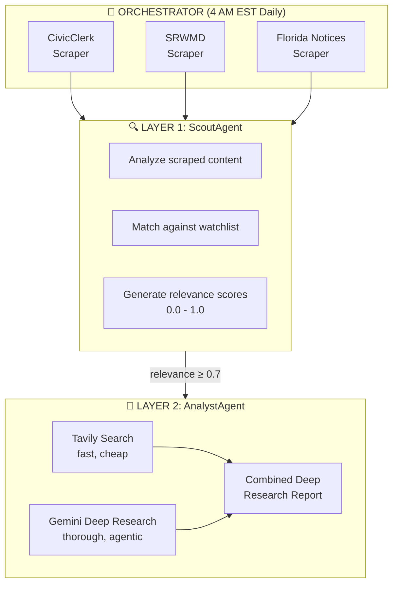
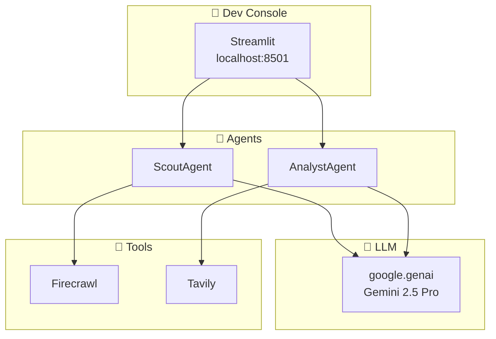

# Work Notes: Alachua Civic Intelligence Reporting Studio

---

## Session: 2026-02-06 (Late Morning) - P2 Sprint: CR-14 through CR-18

**Session Focus:** Implement first batch of P2 medium-priority code review fixes

---

### Completed Items

| CR | Fix | Files Modified/Created |
|:---|:----|:-----------------------|
| **CR-14** | Env-var driven CORS origins | `src/app.py`, `.env.example` |
| **CR-15** | Move state files to `data/state/` with auto-migration | `src/intelligence/event_store.py`, `src/intelligence/health.py`, `src/tools/resource_cache.py`, `.gitignore` |
| **CR-16** | `deepcopy` wrapper on `lru_cache` config functions | `src/config.py` |
| **CR-17** | Supabase dual-write for EventStore | `src/intelligence/event_store.py`, `migrations/002_civic_events.sql` |
| **CR-18** | Orchestrator unit tests (48 tests) | `test/test_orchestrator.py` |

### Key Design Decisions

- **CR-14:** `CORS_ORIGINS` env var with comma-separated origins, defaults to `localhost:8501,localhost:8000`
- **CR-15:** Auto-migration via `shutil.move()` — old files in `config/` auto-move to `data/state/` on first run
- **CR-16:** Private `_load_*` functions get `@lru_cache`, public wrappers return `copy.deepcopy()` — safe for callers
- **CR-17:** Dual-write pattern: file always writes, Supabase writes when available (non-blocking failures)
- **CR-18:** 48 tests across 10 test classes covering all orchestrator methods with fully mocked dependencies

### New Files

- `migrations/002_civic_events.sql` — Supabase table for civic events with indexes + RLS
- `test/test_orchestrator.py` — 48 unit tests for the orchestrator module

### New Environment Variables

- `CORS_ORIGINS` — Comma-separated allowed CORS origins

### Test Results

- **200 passed**, 0 failures (152 existing + 48 new orchestrator tests)

---

## Session: 2026-02-06 (Morning) - P1 Sprint Complete: CR-06 through CR-13

**Session Focus:** Complete all remaining P1 high-priority code review fixes

---

### Completed Items

| CR | Fix | Files Modified/Created |
|:---|:----|:-----------------------|
| **CR-06** | Agent registry + `get_agent()` factory | `src/agents/__init__.py`, `src/app.py`, `src/main.py` |
| **CR-09** | API key header auth on protected routes | `src/app.py`, `.env.example` |
| **CR-08** | Redis-backed state store (in-memory fallback) | `src/state.py` (new), `src/app.py` |
| **CR-11** | `threading.Lock` on all 12 singletons | 12 files across `src/`, `src/tools/`, `src/intelligence/` |
| **CR-12** | Token-counting middleware + budget cap | `src/llm_cost.py` (new), `src/models.py`, `.env.example` |
| **CR-13** | PID files + `stop-all.ps1` | `stop-all.ps1` (new), `start-all.ps1`, `.gitignore` |
| **CR-10** | RAG pipeline wired into orchestrator | `src/orchestrator.py` |

### Key Design Decisions

- **CR-06:** Dict registry chosen over decorator auto-registration for simplicity. All 6 agents (A1-A4, B1-B2) registered with layer and description metadata. `get_agent()` does layer-based routing instead of string prefix matching.
- **CR-08:** `RedisStateStore` falls back to in-memory dicts if Redis unavailable. Uses same Redis URL as Celery broker. Completed runs get 24h TTL, approvals 7d TTL.
- **CR-09:** Auth disabled when `API_KEY` env var is blank (development mode). `/health`, `/info`, `/status`, `/agents`, `/stream` remain public.
- **CR-11:** Double-checked locking pattern (`if x is None: with lock: if x is None:`) used on all 12 singletons for thread safety without unnecessary lock contention.
- **CR-12:** Token-counting middleware chosen over simple call counter per user request. Model pricing table covers Gemini 2.5/2.0/1.5 variants. `BudgetExceededError` raised when daily cap hit. `/costs` endpoint exposes per-model breakdown.
- **CR-13:** PID files in `.pids/` directory. `start-all.ps1` checks for existing PIDs before launching. `stop-all.ps1` stops process trees (parent + children).
- **CR-10:** RAG pipeline lazy-loaded in orchestrator. Ingestion happens during analysis phase (PDF content). Retrieval provides cross-document context to both Scout and Analyst agents. All RAG calls non-blocking (try/except).

### New Files Created

- `src/state.py` — Redis-backed state store with in-memory fallback
- `src/llm_cost.py` — Token counting, model pricing, daily budget enforcement
- `stop-all.ps1` — Process shutdown script

### New API Endpoints

- `GET /agents` — List registered agents with metadata
- `GET /costs` — Daily LLM cost summary (auth required)

### New CLI Features

- `python -m src.main --list-agents` — List all registered agents
- `python -m src.main --agent B1 --topic "..."` — Explicit `--topic` flag for analysts

### New Environment Variables

- `API_KEY` — API authentication key (blank = disabled)
- `LLM_DAILY_BUDGET_USD` — Daily LLM budget cap (0 = unlimited)

### Test Results

- **152 passed, 0 failures** after all changes
- Benign `ValueError: I/O operation on closed file` from colorama/langsmith at exit (not a real error)

---

## Session: 2026-02-05 (Late Evening #2) - P1 Sprint Start: CR-05 & CR-07

**Session Focus:** First two P1 code review fixes — eliminate tools.py collision and unify version numbers

---

### Session Summary

Completed CR-05 and CR-07, the first two items of Sprint 6 (P1). The `importlib` hack in `src/tools/__init__.py` is removed — LangChain tools now live cleanly in `src/tools/langchain_tools.py`. All 4 scattered version strings are unified under `src/__init__.py` with `__version__ = "0.4.0-alpha"`. 152 tests passing, 0 failures.

---

### CR-05: Eliminate `src/tools.py` / `src/tools/` Package Collision

**Problem:** `src/tools.py` (standalone module) and `src/tools/` (package directory) coexisted via a fragile `importlib.util` hack in `__init__.py` that dynamically loaded the standalone file at runtime.

**Solution (Option A):** Moved contents to `src/tools/langchain_tools.py`, replaced hack with clean import.

| Action | File |
|:-------|:-----|
| Created | `src/tools/langchain_tools.py` (131 lines — exact copy of tools.py) |
| Replaced | `src/tools/__init__.py` — removed 20-line `importlib` hack, added 6-line clean import |
| Deleted | `src/tools.py` |
| Updated | `src/agents/scout.py` — removed stale comment about tools.py coexistence |

**Import paths unchanged** — callers still use `from src.tools import monitor_url` (re-exported via `__init__.py`).

---

### CR-07: Unify Version Numbers

**Problem:** 4 different version strings: `pyproject.toml` (0.1.0), `README.md` (v0.4.0), `src/app.py` (2.0.0), `src/ui/app.py` (0.2.0-dev).

**Solution (Option A):** Single canonical `__version__` in `src/__init__.py`, imported everywhere.

| Action | File | Change |
|:-------|:-----|:-------|
| Created | `src/__init__.py` | `__version__ = "0.4.0-alpha"` |
| Updated | `pyproject.toml` | `version = "0.4.0-alpha"` |
| Updated | `src/app.py` | `from src import __version__`; `version=__version__` in FastAPI |
| Updated | `src/ui/app.py` | `from src import __version__`; `st.caption(f"Version: {__version__}")` |

---

### Test Results

```
152 passed, 0 failures in ~9s
```

---

### Next Steps

1. CR-06: Create agent registry/factory pattern (4h)
2. CR-09: Add API authentication (2h)
3. CR-08: Move run/approval state to Redis (4h)

---
---

## Session: 2026-02-05 (Late Evening) - P0 Remediation Implementation

**Session Focus:** Implement all 4 P0 critical code review fixes (CR-01 through CR-04)

---

### Session Summary

Implemented all P0 critical fixes identified in the earlier code review session. All 4 items completed with 156 tests passing (0 failures). The intelligence layer is now bridged to the orchestrator, AnalystAgent uses the correct schema, import bugs are fixed, and agent tests are real.

---

### Implementations

#### CR-03: Fix Missing Imports and Dependencies (5 single-line fixes)

| File | Fix |
|:-----|:----|
| `src/app.py` | Added `import os` (used by `main()`) |
| `requirements.txt` | Added `sse-starlette==2.2.1` |
| `src/exceptions.py` | Fixed `any` → `Any` (added `from typing import Any`) |
| `src/database.py` | Removed duplicate `import json` inside method |
| `src/config.py` | Removed unused `field_validator` import |

#### CR-02: Fix AnalystAgent Schema

| File | Change |
|:-----|:-------|
| `src/agents/analyst.py` | Import `AnalystReport` instead of `ScoutReport` |
| `src/agents/analyst.py` | `with_structured_output(AnalystReport)` |
| `src/agents/analyst.py` | Updated prompt to reference AnalystReport fields |
| `src/agents/analyst.py` | Updated return type annotation and logging |
| `src/database.py` | Updated `save_deep_research_report` to accept `AnalystReport` |

#### CR-01: Bridge Intelligence Layer to Orchestrator

**Scraper modifications** (expose raw items for adapter consumption):

| File | Change |
|:-----|:-------|
| `src/tools/civicclerk_scraper.py` | Added `raw_meetings` to pipeline result dict |
| `src/tools/florida_notices_scraper.py` | Added `raw_notices` to pipeline result dict |
| `src/tools/srwmd_scraper.py` | Added `raw_notices` to pipeline result dict |

**Orchestrator modifications:**

| File | Change |
|:-----|:-------|
| `src/orchestrator.py` | Added imports for adapters, EventStore, RulesEngine, Alert |
| `src/orchestrator.py` | Initialized adapters dict, event_store, rules_engine in `__init__` |
| `src/orchestrator.py` | Added `_process_intelligence()` method (adapt → save → evaluate) |
| `src/orchestrator.py` | Wired `_process_intelligence()` into all 3 job runners |
| `src/orchestrator.py` | Added `events_created`, `alerts_generated` to `JobResult` |
| `src/orchestrator.py` | Updated `generate_summary()` with event/alert reporting |

#### CR-04: Implement Real Agent Tests

Replaced 7 skipped empty stubs with 11 real tests:

| Test Class | Tests | What's Tested |
|:-----------|:------|:-------------|
| `TestBaseAgent` | 3 | Init/logging, run returns report, error propagation |
| `TestScoutAgent` | 4 | Init, validation, PDF mode prompt, metadata mode prompt |
| `TestAnalystAgent` | 4 | Init with AnalystReport schema, validation, Tavily flow, Tavily failure |

**Bonus fixes during CR-04:**
- Fixed all `Optional` fields in `src/schemas.py` — added `default=None` for Pydantic 2.x compat
- Added `raw_markdown` and `date_generated` fields to `ScoutReport`
- Added `default_factory` for `alerts` (BaseReport) and `items` (ScoutReport)
- Added defaults for `created_at` and `status` on `ApprovalRequest`
- Fixed `conftest.py` `sample_scout_report` fixture (MeetingItem missing required fields)
- Fixed `test_schemas.py` test cases to provide all required fields

---

### Test Results

```
156 passed, 0 failures in ~12s
- 11 agent tests (was 7 skipped stubs)
- 39 scraper tests
- 39 intelligence tests
- 9 schema tests (was 4 failing)
- 14 config tests
- 12 API tests
- 22 health tests
- 10 other tests
```

---

### Files Modified

| File | Changes |
|:-----|:--------|
| `src/app.py` | Added `import os` |
| `src/config.py` | Removed unused `field_validator` |
| `src/database.py` | Removed duplicate import, updated `save_deep_research_report` |
| `src/exceptions.py` | Fixed `any` → `Any` typing |
| `src/schemas.py` | Fixed Optional defaults, added ScoutReport fields, ApprovalRequest defaults |
| `src/agents/analyst.py` | AnalystReport schema, prompt, return type |
| `src/orchestrator.py` | Intelligence layer bridge (imports, init, method, wiring, summary) |
| `src/tools/civicclerk_scraper.py` | Exposed `raw_meetings` in pipeline result |
| `src/tools/florida_notices_scraper.py` | Exposed `raw_notices` in pipeline result |
| `src/tools/srwmd_scraper.py` | Exposed `raw_notices` in pipeline result |
| `requirements.txt` | Added `sse-starlette==2.2.1` |
| `test/test_agents.py` | 11 real tests replacing 7 skipped stubs |
| `test/test_schemas.py` | Fixed MeetingItem test with required fields |
| `test/conftest.py` | Fixed sample_scout_report fixture |

---

### Next Steps

1. Start Sprint 6: P1 High-Priority fixes
2. CR-05: Eliminate tools.py/tools/ package collision
3. CR-07: Unify version numbers
4. CR-10: Wire RAG pipeline into production

---
---

## Session: 2026-02-05 (Evening) - Comprehensive Code Review

**Session Focus:** Full codebase and documentation review, findings report, project plan updates

---

### Session Summary

Performed a comprehensive code review of the entire codebase covering all architectural layers. Identified 29 actionable items (CR-01 to CR-29) organized by priority. Integrated all findings into project planning docs.

---

### Code Review Scope

Reviewed every file in the project across these areas:

| Area | Files Reviewed | Key Findings |
|:-----|:---------------|:-------------|
| Configuration | pyproject.toml, requirements.txt, docker-compose.yml, Dockerfile, .env.example | 4 different version strings, sse-starlette missing from deps |
| Core Application | app.py, config.py, database.py, exceptions.py, models.py, schemas.py, orchestrator.py | Missing `os` import, in-memory state, no API auth, CORS anti-pattern |
| Agents | base.py, scout.py, analyst.py | AnalystAgent uses ScoutReport instead of AnalystReport |
| Intelligence | models.py, event_store.py, rules_engine.py, health.py, all adapters | Fully built but never called from orchestrator (dead code) |
| RAG Pipeline | embeddings.py, chunking.py, vector_store.py, rag_pipeline.py | Complete stack built but never wired into production |
| Scrapers | civicclerk_scraper.py, firecrawl_client.py, srwmd_scraper.py, florida_notices_scraper.py | Well-tested (39 tests), URL validation good |
| Tools | tools.py, tools/__init__.py, resource_cache.py, gemini_research.py | Fragile importlib hack for tools.py/tools/ collision |
| Workflows | graphs.py | LangGraph workflows exist but disconnected from pipeline |
| Tasks | celery_app.py, scout_tasks.py | 4 AM scheduling works, but no Celery health visibility |
| Tests | All test files | 78 real tests (scrapers + intelligence), 0 agent tests (all empty stubs) |
| UI | ui/app.py | sys.path manipulation, different version string |
| Infrastructure | start-all.ps1, .pre-commit-config.yaml, migrations/ | No stop script, no Redis/Celery start, migration gaps |

---

### Critical Findings (P0)

1. **CR-01: Intelligence layer is dead code** — Orchestrator never calls adapters, so CivicEvents, EventStore, RulesEngine, and watchdog alerts are never used. This is the single highest-impact fix.
2. **CR-02: AnalystAgent uses wrong schema** — Outputs ScoutReport instead of AnalystReport, losing structured sections/recommendations.
3. **CR-03: Missing imports/deps** — `os` not imported in app.py, `sse-starlette` not in requirements.txt.
4. **CR-04: Zero agent test coverage** — All tests in test_agents.py are skip-decorated empty stubs.

### High-Priority Findings (P1)

5. **CR-05: tools.py/tools/ package collision** with importlib hack
6. **CR-06: Fragile string-prefix agent routing** (`A*` = Scout, `B*` = Analyst)
7. **CR-07: 4 different version strings** (pyproject=0.1.0, README=0.4.0, app=2.0.0, ui=0.2.0)
8. **CR-08: In-memory run/approval state** lost on restart
9. **CR-09: No API authentication** on any endpoint
10. **CR-10: RAG pipeline built but never called**
11. **CR-11: 12+ singletons with no thread safety**
12. **CR-12: No LLM rate limiting or cost controls**
13. **CR-13: No graceful shutdown or process management**

### Key Architectural Insight

Three major subsystems are **fully implemented in isolation** but **disconnected from production**:
1. **Intelligence Layer** (EventStore + RulesEngine + Adapters) — never called
2. **RAG Pipeline** (chunk + embed + store + retrieve) — never called
3. **LangGraph Workflows** (Scout + Analyst graphs) — never called

Connecting these provides more value than writing any new code.

### Strength: Scraper & Intelligence Tests

The scraper tests (39) and intelligence tests (39) are well-implemented with real assertions, mock data, and comprehensive coverage. This is the best-tested part of the codebase.

---

### Documents Updated

| Document | Changes |
|:---------|:--------|
| `TODO.md` | Added 29 CR items organized by priority (P0/P1/P2/P3), marked Phase 3 items as complete |
| `docs/PROJECT_PLAN.md` | Added Phase 3c: Code Review Remediation with 3 sprints, updated Gantt chart, expanded Phase 4 |
| `docs/PROJECT_MANAGEMENT.md` | Added Epic E6 with 6 features (F6.1-F6.6), 40+ tasks, sprint backlog, decision log entries |
| `WORK_NOTES.md` | This session entry |

---

### Recommended Work Order

**Sprint 5 (Feb 6-12): P0 Critical Fixes**
1. CR-03 — Fix missing imports/deps (30 min, quick wins)
2. CR-02 — Fix AnalystAgent schema (2h)
3. CR-01 — Bridge intelligence layer to orchestrator (8h, highest impact)
4. CR-04 — Implement real agent tests (6h)

**Sprint 6 (Feb 13-20): P1 High Priority**
5. CR-05 — Eliminate tools.py collision (2h)
6. CR-07 — Unify version numbers (1h)
7. CR-06 — Agent registry/factory (4h)
8. CR-10 — Wire RAG pipeline (8h)
9. CR-09 — API authentication (2h)
10. CR-08 — Redis-backed state (4h)
11. CR-11 — Thread-safe singletons (4h)
12. CR-12 — LLM rate limiting (4h)
13. CR-13 — Graceful shutdown (4h)

**Sprint 7 (Feb 21-28): P2 Medium Priority**
14. CR-14 through CR-25 — Data integrity, testing, hardening

---

### Next Steps

1. Start Sprint 5: Begin with CR-03 (quick import fixes)
2. Then CR-02 (AnalystAgent schema fix)
3. Then CR-01 (bridge intelligence layer — the big one)

---
---

## Session: 2026-02-05 - Two-Layer Agent Architecture & Gemini Deep Research

**Session Focus:** Integrate Gemini Deep Research, implement two-layer agent architecture, scheduled pipeline runs

---

### Session Summary

Completed the two-layer agent architecture with dual research providers:
1. Created Gemini Deep Research client wrapper
2. Updated AnalystAgent to support Tavily + Gemini Deep Research
3. Integrated AnalystAgent into Orchestrator pipeline
4. Added 4 AM EST daily scheduled runs via Celery Beat
5. Added manual run UI in Orchestrator Panel
6. Comprehensive documentation updates

---

### Major Implementations

#### 1. Gemini Deep Research Client (`src/tools/gemini_research.py`)

New client wrapper for Google's Interactions API:
- Uses `deep-research-pro-preview-12-2025` agent
- Async polling with configurable timeout (default 5 min)
- `ResearchStatus` enum: PENDING, IN_PROGRESS, COMPLETED, FAILED
- `ResearchResult` dataclass with text, sources, status

```python
from src.tools.gemini_research import get_gemini_research_client

client = get_gemini_research_client()
result = client.research("Tara Forest development Alachua County", timeout_seconds=300)
```

#### 2. AnalystAgent Dual Research Providers

Updated `src/agents/analyst.py` with:
- `ResearchProvider` enum: TAVILY, GEMINI, BOTH
- `_research_with_tavily()` - Fast web search
- `_research_with_gemini()` - Comprehensive agentic research
- `_execute_research()` - Combines results from both providers

```python
from src.agents.analyst import AnalystAgent, ResearchProvider

# Use both providers (default)
analyst = AnalystAgent(name="Analyst", research_provider=ResearchProvider.BOTH)
```

#### 3. Orchestrator Pipeline Integration

Updated `src/orchestrator.py`:
- Added `AnalystAgent` initialization with configurable research provider
- Added `_run_deep_research()` method for Layer 2 analysis
- Triggers on high-relevance items (≥0.7 score)
- Added `skip_deep_research` parameter to `run_source()`

#### 4. Celery Beat Scheduling

Updated `src/tasks/celery_app.py`:
- Daily orchestrator pipeline at **4:00 AM EST**
- New `run_orchestrator_pipeline` task
- New `run_single_source` task for manual triggers
- Task routing to `orchestrator` queue

#### 5. Orchestrator Panel UI Enhancements

Updated `src/ui/pages/orchestrator_panel.py`:
- Added schedule info display (4 AM EST)
- Added "Skip Deep Research" checkbox
- Added "Run in Background (Celery)" option
- Shows task ID when queued for background execution

#### 6. Database Deep Research Methods

Updated `src/database.py`:
- `get_high_relevance_reports()` - Find reports needing deep research
- `save_deep_research_report()` - Save and link deep research results

---

### Files Created

| File | Lines | Purpose |
|:-----|:------|:--------|
| `src/tools/gemini_research.py` | 235 | Gemini Deep Research client |

### Files Modified

| File | Changes |
|:-----|:--------|
| `src/agents/analyst.py` | Added dual research providers |
| `src/orchestrator.py` | Added AnalystAgent integration, deep research |
| `src/tasks/celery_app.py` | Added 4 AM schedule, orchestrator tasks |
| `src/tasks/scout_tasks.py` | Added orchestrator pipeline tasks |
| `src/database.py` | Added deep research methods |
| `src/ui/pages/orchestrator_panel.py` | Added schedule info, async runs |
| `src/tools/__init__.py` | Export Gemini research classes |
| `requirements.txt` | Added google-genai==1.60.0 |
| `.env.example` | Documented research providers |

### Documentation Updated

| File | Changes |
|:-----|:--------|
| `docs/ARCHITECTURE.md` | Two-layer agent framework, updated diagrams |
| `docs/DEVELOPER_GUIDE.md` | Updated architecture section |
| `docs/SYSTEM_OVERVIEW.md` | Dual research providers |
| `docs/USER_GUIDE.md` | 4 AM schedule, Orchestrator Panel |
| `docs/PROJECT_PLAN.md` | Phase 3 complete, deliverables |
| `docs/PROJECT_MANAGEMENT.md` | E3 Analyst Layer complete |
| `TODO.md` | Added Feb 5 completed items |

---

### Architecture: Two-Layer Agent System



---

### How to Use

**Start Scheduled Runs:**
```bash
# Terminal 1: Celery worker
celery -A src.tasks.celery_app worker --loglevel=info -Q orchestrator,scouts

# Terminal 2: Celery Beat scheduler
celery -A src.tasks.celery_app beat --loglevel=info
```

**Manual Runs:**
```python
from src.tasks.scout_tasks import run_orchestrator_pipeline

# Queue full pipeline
run_orchestrator_pipeline.delay(force=True)
```

---

### Next Steps

1. Test full pipeline with real data
2. Add integration tests for deep research
3. Implement human-in-the-loop approval flow
4. Add email notifications for high-relevance items

---
---

## Session: 2026-02-02 - Phase 3 Intelligence Layer

**Session Focus:** Intelligent Evolution - Event-driven architecture, CivicEvent model, adapters, EventStore, Watchdog Rules Engine

---

### Session Summary

Implemented Phase 3 "Intelligent Evolution" with an event-driven, user-centric architecture:
1. Created unified CivicEvent model normalizing all scraper output
2. Built source adapters for CivicClerk, SRWMD, and Florida Notices
3. Implemented EventStore with persistence and query capabilities
4. Created Watchdog Rules Engine with 14 configurable civic alert rules
5. Integrated ResourceCache into all 3 scrapers
6. Created source playbook generator and sitemap discovery scripts
7. **78 tests passing** (39 scraper + 39 intelligence)

---

### Major Implementations

#### 1. Intelligence Layer (`src/intelligence/`)

New module providing event-driven intelligence capabilities:

```
src/intelligence/
├── __init__.py              # Module exports
├── models.py                # CivicEvent, Entity, Document, Alert (~300 lines)
├── event_store.py           # Persistence + queries (~400 lines)
├── rules_engine.py          # Watchdog alerts (~400 lines)
└── adapters/
    ├── __init__.py
    ├── base_adapter.py      # Base class with entity/tag extraction
    ├── civicclerk_adapter.py
    ├── srwmd_adapter.py
    └── florida_notices_adapter.py
```

**CivicEvent Model:**
```python
@dataclass
class CivicEvent:
    event_id: str
    event_type: EventType      # meeting, permit_application, permit_issued, public_notice
    source_id: str
    timestamp: datetime
    title: str
    description: Optional[str]
    location: Optional[GeoLocation]
    entities: List[Entity]     # People, orgs, addresses
    documents: List[Document]
    tags: List[str]            # For filtering
    content_hash: str          # For change detection
    raw_data: Dict
```

#### 2. EventStore (`src/intelligence/event_store.py`)

Persistent storage with query capabilities:
- `save_event()` - Detects new vs updated vs unchanged
- `get_events()` - Filter by source, type, tags, time range
- `get_whats_new()` - Events discovered in last N hours
- `get_upcoming()` - Future events (meetings, hearings)
- `get_by_entity()` - Find events mentioning an entity
- `get_by_county()` - Filter by county

#### 3. Watchdog Rules Engine (`src/intelligence/rules_engine.py`)

Rule-based alert generation for civic watchdog use cases:
- Loads rules from `config/watchdog_rules.yaml`
- Evaluates CivicEvents against configurable conditions
- Generates alerts with severity levels (info, notable, warning, urgent)

**14 Default Rules:**
| Category | Rules |
|:---------|:------|
| Permits | new-alachua-permit, permit-issued-alachua |
| Rezoning | rezoning-alert, comprehensive-plan-change, variance-request |
| Environmental | environmental-concern, santa-fe-river |
| Meetings | upcoming-meeting-48h, public-hearing, planning-commission |
| Development | large-development, annexation |
| Notices | legal-notice-alachua |

#### 4. Source Adapters

Convert scraper output to unified CivicEvent format:
- **CivicClerkAdapter**: Meetings → CivicEvents with board entities, agenda documents
- **SRWMDAdapter**: Permits → CivicEvents with project entities, location, permit type tags
- **FloridaNoticesAdapter**: Notices → CivicEvents with county location, PDF documents

#### 5. ResourceCache Integration

All 3 scrapers now auto-update discovered resources cache:
- `config/discovered_resources.yaml` - Persistent cache of known IDs
- `src/tools/resource_cache.py` - Read/write utility
- CivicClerk: 20 event IDs cached
- SRWMD: Permit IDs and document IDs cached
- Florida Notices: Notice IDs and PDF URLs cached

#### 6. Source Discovery Scripts

- `scripts/discover_sitemaps.py` - Firecrawl map_site API integration
- `scripts/analyze_sources.py` - Deep content sampling, playbook generation
- `config/source_playbooks/` - 5 YAML playbooks generated

---

### Architecture Decision

**Chose Option C: Event-driven + User-centric hybrid**

Instead of complex layered infrastructure, we built:
1. **Unified CivicEvent model** - Single query interface across all sources
2. **Change detection at scrape time** - Not batch snapshot comparison
3. **Rule-based alerts** - Explicit, auditable, citizen-understandable
4. **Simpler self-healing** - Health as scraper property, not separate system

**Primary Use Case:** Grassroots civic watchdog monitoring for concerning activity

---

### Files Created

| File | Lines | Purpose |
|:-----|:------|:--------|
| `src/intelligence/__init__.py` | 40 | Module exports |
| `src/intelligence/models.py` | 300 | CivicEvent, Entity, Document, Alert |
| `src/intelligence/event_store.py` | 400 | Event persistence and queries |
| `src/intelligence/rules_engine.py` | 400 | Watchdog alert generation |
| `src/intelligence/adapters/__init__.py` | 15 | Adapter exports |
| `src/intelligence/adapters/base_adapter.py` | 140 | Base adapter with entity extraction |
| `src/intelligence/adapters/civicclerk_adapter.py` | 250 | CivicClerk → CivicEvent |
| `src/intelligence/adapters/srwmd_adapter.py` | 280 | SRWMD → CivicEvent |
| `src/intelligence/adapters/florida_notices_adapter.py` | 270 | Florida Notices → CivicEvent |
| `config/watchdog_rules.yaml` | 150 | 14 civic watchdog rules |
| `config/discovered_resources.yaml` | 60 | Resource cache |
| `src/tools/resource_cache.py` | 170 | Cache utility |
| `scripts/discover_sitemaps.py` | 645 | Sitemap discovery |
| `scripts/analyze_sources.py` | 872 | Playbook generator |
| `test/test_intelligence.py` | 400 | 39 intelligence tests |

### Files Modified

| File | Changes |
|:-----|:--------|
| `src/tools/civicclerk_scraper.py` | Added ResourceCache integration |
| `src/tools/srwmd_scraper.py` | Added ResourceCache integration |
| `src/tools/florida_notices_scraper.py` | Added ResourceCache integration |
| `src/tools/__init__.py` | Export ResourceCache |
| `TODO.md` | Added Phase 3 items |
| `docs/PROJECT_PLAN.md` | Added Phase 3 architecture |

---

### Test Results

```
78 passed in 2.54s
- 39 scraper tests
- 39 intelligence tests (21 model + 10 store + 8 rules)
```

---

### Phase 3 Progress

| Phase | Status | Description |
|:------|:-------|:------------|
| **3.1** | ✅ Complete | CivicEvent model + adapters |
| **3.2** | ✅ Complete | EventStore + queries |
| **3.3** | ✅ Complete | Watchdog rules engine |
| **3.4** | 🔲 Pending | Health metrics in scrapers |
| **3.5** | 🔲 Pending | User watchlists |
| **3.6** | 🔲 Pending | Entity extraction for linking |
| **3.7** | 🔲 Pending | Cross-source search |

---

### Next Steps

1. Phase 3.4: Health metrics embedded in scrapers
2. Phase 3.5: User watchlists
3. Comprehensive documentation update

---
---

## Session: 2026-02-01 - Phase 2 Complete + Code Review Fixes

**Session Focus:** Hybrid Scraping Pipeline, SRWMD Scraper, Orchestrator, Code Review

---

### Session Summary

Completed Phase 2 of the project including:
1. Hybrid scraping pipeline with Discovery + Detail phases
2. SRWMD permit scraper (applications + issuances + E-Permitting detail)
3. Central Orchestrator for pipeline coordination
4. Comprehensive code review and fixes
5. Streamlit UI improvements

---

### Major Implementations

#### 1. SRWMD Permit Scraper (`src/tools/srwmd_scraper.py`)
- **767 lines** of new code
- Scrapes permit applications from `/1616/Notice-of-Receipt-of-Applications`
- Scrapes permit issuances from `/1617/Notice-of-Permit-Issuance`
- E-Permitting portal detail page scraping with document list extraction
- County filtering (Alachua focus)
- Data classes: `PermitNotice`, `PermitDetail`, `PermitDocument`

#### 2. Orchestrator (`src/orchestrator.py`)
- **630 lines** - Central pipeline coordinator
- Job scheduling based on source frequency
- Source-specific job runners (CivicClerk, Florida Notices, SRWMD)
- Scout Agent integration for analysis
- Pipeline run tracking with `JobResult` and `PipelineRun` dataclasses
- CLI interface for command-line execution

#### 3. Orchestrator UI (`src/ui/pages/orchestrator_panel.py`)
- Dashboard with source status
- Run Pipeline tab with source selection
- History tab for past runs
- Fixed nested expander Streamlit bug

#### 4. Source Configuration (`config/sources.yaml`)
- Added `srwmd-permit-applications` (critical, daily)
- Added `srwmd-permit-issuances` (critical, daily)
- Updated with custom scraper references

#### 5. Streamlit Sidebar Cleanup
- Removed redundant auto-generated navigation
- Added Target Data Sources section with link buttons
- Created `.streamlit/config.toml` with `showSidebarNavigation = false`

---

### Code Review Fixes

#### High Priority (Fixed)

1. **Removed unused `asyncio` import** in `src/orchestrator.py`
2. **Fixed hardcoded `site_id`** - Now extracted from source URL config
3. **Added URL validation** in `src/tools/firecrawl_client.py`:
   - `ALLOWED_DOMAINS` allowlist for security
   - `_validate_url()` method
   - Validation in `scrape_page()`, `scrape_pdf()`, `map_site()`
4. **Added `SourceType` constants** for consistent source matching

#### Medium Priority (Noted for future)

- Add scraper unit tests with mocked responses
- Add database FK constraints
- Implement async/parallel scraping
- Add connection pooling for production

---

### Files Created

| File | Lines | Purpose |
|:-----|:------|:--------|
| `src/tools/srwmd_scraper.py` | 767 | SRWMD permit scraper |
| `src/orchestrator.py` | 630 | Pipeline orchestrator |
| `src/ui/pages/orchestrator_panel.py` | 292 | Orchestrator UI |
| `.streamlit/config.toml` | 9 | Streamlit config |

### Files Modified

| File | Changes |
|:-----|:--------|
| `config/sources.yaml` | Added SRWMD sources |
| `src/ui/app.py` | Added Orchestrator tab, updated sidebar |
| `src/ui/pages/source_tester.py` | Added SRWMD test function |
| `src/tools/firecrawl_client.py` | Added URL validation |
| `migrations/001_scraped_meetings.sql` | Already existed, reviewed |

---

### Target Data Sources (Active)

| Source | URL | Scraper | Status |
|:-------|:----|:--------|:-------|
| CivicClerk | `https://alachuafl.portal.civicclerk.com/` | `CivicClerkScraper` | ✅ Ready |
| Florida Public Notices | `https://floridapublicnotices.com/` | `FloridaNoticesScraper` | ✅ Ready |
| SRWMD Applications | `https://www.mysuwanneeriver.com/1616/` | `SRWMDScraper` | ✅ Ready |
| SRWMD Issuances | `https://www.mysuwanneeriver.com/1617/` | `SRWMDScraper` | ✅ Ready |

---

### Next Steps

1. Add scraper unit tests
2. Test full pipeline with real data
3. Phase 3: Intelligent Evolution (learning, pattern detection)

---
---

## Session: 2026-01-29 (Previous)

**Session Focus:** P0 and P1 Bug Fixes and Core Implementation

---

## Session Summary

This session addressed all critical (P0) and high-priority (P1) issues identified in the code review. The codebase is now aligned with the documented architecture in the README.

---

## Changes Made

### 🔴 P0 - Critical Fixes

#### 1. `src/tools.py` - Replaced Broken Dependencies
**Before:** Used `requests` and `BeautifulSoup` (removed from requirements)
**After:** Implemented Firecrawl-based scraping with:
- Lazy client initialization
- `monitor_url()` - Scrapes web pages with JS rendering
- `scrape_pdf()` - Extracts text from PDF URLs
- `deep_research()` - Tavily search integration

#### 2. `src/models.py` - Fixed Invalid Model Names
**Before:** `gemini-3.0-pro`, `gemini-3.0-flash` (don't exist)
**After:** `gemini-2.5-pro`, `gemini-2.5-flash`
- Added lazy API key loading
- Added docstrings

#### 3. `src/config.py` - Removed Module-Level Crash
**Before:** Raised `ValueError` on import if `GOOGLE_API_KEY` missing
**After:** Removed validation at import time
- Added `CELERY_BROKER_URL` and `CELERY_RESULT_BACKEND` exports
- Legacy exports now have warning comments

---

### 🟠 P1 - Core Implementation

#### 4. Deleted `src/registry.py`
**Reason:** Duplicated `config/sources.yaml`
**Updated:** `src/main.py` to use `config.get_sources_by_priority()`

#### 5. Created `src/tools/` Package
New files:
- `src/tools/__init__.py`
- `src/tools/firecrawl_client.py` - Full Firecrawl wrapper with:
  - Retry logic with exponential backoff
  - `scrape_page()` - JS-rendered pages
  - `scrape_pdf()` - PDF extraction
  - `scrape_civicclerk()` - CivicClerk-specific scraper
  - `map_site()` - URL discovery
  - `batch_scrape()` - Multiple URLs
- `src/tools/docling_processor.py` - Document processing with:
  - `process_file()` - Local files
  - `process_url()` - Remote documents
  - `process_bytes()` - In-memory content
  - `extract_tables()` - Table extraction
  - `chunk_text()` - LangChain text splitting

#### 6. Created `src/app.py` - FastAPI Application
Endpoints:
- `GET /` - Health check
- `GET /health` - Health status
- `GET /info` - Instance information
- `POST /run` - Start agent run
- `GET /status/{run_id}` - Check run status
- `GET /runs` - List recent runs
- `GET /approvals/pending` - List pending approvals
- `GET /approvals/{id}` - Get approval details
- `POST /approvals/{id}/decide` - Approve/reject
- `GET /stream/{run_id}` - SSE streaming

#### 7. Created `src/tasks/` Package - Celery Integration
New files:
- `src/tasks/__init__.py`
- `src/tasks/celery_app.py` - Celery configuration with:
  - Redis broker/backend
  - Beat schedule (daily scouts, weekly analysts, monthly synthesizers)
  - Task routing by queue
- `src/tasks/scout_tasks.py` - Scout task definitions:
  - `run_scout()` - Single URL
  - `run_all_critical_scouts()` - All critical sources
  - `run_scout_for_source()` - By source ID

#### 8. Created `src/api/routes/` Package
New files:
- `src/api/__init__.py`
- `src/api/routes/__init__.py`
- `src/api/routes/workflows.py` - Workflow endpoints
- `src/api/routes/approvals.py` - Approval endpoints

#### 9. Created `src/workflows/` Package - LangGraph
New files:
- `src/workflows/__init__.py`
- `src/workflows/graphs.py` - Workflow definitions:
  - `ScoutState` / `AnalystState` - TypedDict states
  - `create_scout_workflow()` - fetch → analyze → save
  - `create_analyst_workflow()` - gather → synthesize → [approve] → publish
  - `run_scout_workflow()` / `run_analyst_workflow()` - Runners

---

## Files Created

```
src/
├── app.py                    # NEW - FastAPI application
├── tools/
│   ├── __init__.py          # NEW
│   ├── firecrawl_client.py  # NEW - Firecrawl wrapper
│   └── docling_processor.py # NEW - Document processing
├── tasks/
│   ├── __init__.py          # NEW
│   ├── celery_app.py        # NEW - Celery configuration
│   └── scout_tasks.py       # NEW - Scout tasks
├── api/
│   ├── __init__.py          # NEW
│   └── routes/
│       ├── __init__.py      # NEW
│       ├── workflows.py     # NEW - Workflow routes
│       └── approvals.py     # NEW - Approval routes
└── workflows/
    ├── __init__.py          # NEW
    └── graphs.py            # NEW - LangGraph workflows
```

## Files Modified

- `src/tools.py` - Replaced requests/bs4 with Firecrawl
- `src/models.py` - Fixed model names, lazy loading
- `src/config.py` - Removed import-time crash
- `src/main.py` - Updated to use YAML config

## Files Deleted

- `src/registry.py` - Redundant, replaced by YAML config

---

## Current Project Structure

```
src/
├── agents/
│   ├── base.py
│   ├── scout.py
│   └── analyst.py
├── api/
│   ├── __init__.py
│   └── routes/
│       ├── __init__.py
│       ├── workflows.py
│       └── approvals.py
├── tasks/
│   ├── __init__.py
│   ├── celery_app.py
│   └── scout_tasks.py
├── tools/
│   ├── __init__.py
│   ├── firecrawl_client.py
│   └── docling_processor.py
├── workflows/
│   ├── __init__.py
│   └── graphs.py
├── app.py           # FastAPI application
├── config.py        # Configuration loader
├── database.py      # Supabase client
├── main.py          # CLI entry point
├── models.py        # LLM configuration
├── schemas.py       # Pydantic models
└── tools.py         # LangChain tools
```

---

## Next Steps (P2 Items)

1. Fix `src/database.py` - Lazy initialization
2. Create additional schemas (AnalystReport, SynthesizerReport)
3. Fix `src/agents/base.py` - Return type
4. Create `docs/DEVELOPER_GUIDE.md`
5. Add embedding/vector support

---

## Running the Application

### FastAPI Server
```bash
uvicorn src.app:app --reload --port 8000
```

### Celery Worker
```bash
celery -A src.tasks.celery_app worker --loglevel=info
```

### Celery Beat (Scheduler)
```bash
celery -A src.tasks.celery_app beat --loglevel=info
```

### CLI (Legacy)
```bash
python -m src.main --agent A1 --url https://example.com
```

---

## Notes

- All P0 and P1 items completed
- Codebase now matches README architecture
- In-memory state used for runs/approvals (replace with Redis/DB in production)
- LangGraph workflows use MemorySaver (replace with Supabase checkpointer in production)

---

## Session 2: Project Documentation (2026-01-29 Evening)

### Documents Created

#### 1. `docs/PROJECT_PLAN.md`
High-level project plan and roadmap including:
- Executive summary and vision
- Timeline with 4 phases (Foundation → Scout → Analyst → Integration)
- Phase breakdown with deliverables and milestones
- Release plan (v1.0, v1.1, v2.0)
- Resource requirements and cost estimates
- Risk assessment
- Success metrics

#### 2. `docs/SPEC.md`
Technical specification document including:
- System architecture diagrams
- Technology stack details
- Data models and schemas (Pydantic + SQL)
- API specification (all endpoints)
- Agent specifications (Scout/Analyst workflows)
- Configuration requirements
- Security considerations
- Performance requirements
- Deployment instructions

#### 3. `docs/PROJECT_MANAGEMENT.md`
Azure DevOps-style project tracking including:
- 5 Epics (E1-E5)
- 15+ Features with user stories
- 50+ Tasks with estimates
- Sprint backlog
- Velocity tracking
- Risk register
- Decision log
- Meeting notes section

### Project Name
**Confirmed:** Open Sousveillance Studio (updated in PROJECT_PLAN.md)

### Key Dates
| Milestone | Target Date |
|:----------|:------------|
| Phase 2 Complete | Feb 15, 2026 |
| Phase 3 Complete | Mar 15, 2026 |
| v1.0 Release | Apr 1, 2026 |

### Next Actions
1. Begin CivicClerk scraper implementation (T2.2.1-T2.2.6)
2. Implement change detection (T2.6.1-T2.6.4)
3. Write integration tests for Scout layer

---

## Session 3: Testing, Security & Dev Console (2026-01-30)

### Session Focus
- Codebase review and testing
- Security vulnerability scanning
- Streamlit Dev Console implementation
- Native Google GenAI SDK migration

### Major Accomplishments

#### 1. Security Scan & Fixes
- Ran `pip-audit`, `bandit`, and `safety` scans
- Fixed hardcoded `0.0.0.0` host binding → environment variable
- Pinned all dependencies to specific versions in `requirements.txt`
- Added `HOST`, `PORT`, `RELOAD` env vars

#### 2. Streamlit Dev Console
Created browser-based testing interface at `src/ui/`:

```
src/ui/
├── __init__.py
├── app.py                    # Main Streamlit app
└── pages/
    ├── __init__.py
    ├── agent_runner.py       # Test Scout/Analyst agents
    ├── prompt_inspector.py   # View prompt library
    ├── source_tester.py      # Test web scraping
    └── config_viewer.py      # View YAML configs
```

**Run with:** `streamlit run src/ui/app.py`

#### 3. Native Google GenAI SDK Migration
Replaced `langchain_google_genai` with native `google.genai` SDK to fix PyTorch DLL loading issues on Windows:

- `src/models.py` - New `GeminiModel` and `StructuredGeminiModel` classes
- `src/agents/scout.py` - Updated to use native SDK
- `src/agents/analyst.py` - Updated to use native SDK
- Fixed model names: `gemini-2.5-pro`, `gemini-2.5-flash`

#### 4. Test Suite Fixes
- Fixed NumPy version conflict (`numpy<2` for docling)
- Fixed test mocks to match actual implementations
- Cleaned Celery beat schedule (removed non-existent tasks)
- **Result:** 37 tests passing, 7 skipped

### Files Created
- `src/ui/__init__.py`
- `src/ui/app.py`
- `src/ui/pages/__init__.py`
- `src/ui/pages/agent_runner.py`
- `src/ui/pages/prompt_inspector.py`
- `src/ui/pages/source_tester.py`
- `src/ui/pages/config_viewer.py`
- `pytest.ini`

### Files Modified
- `requirements.txt` - Pinned versions, added streamlit
- `src/models.py` - Native google.genai SDK
- `src/agents/scout.py` - Removed LangChain dependency
- `src/agents/analyst.py` - Removed LangChain dependency
- `src/tools/__init__.py` - Export tools, catch OSError
- `src/app.py` - Environment variable for host binding
- `.env.example` - Added HOST, PORT, RELOAD vars

### Current Architecture



### Test Results
```
37 passed, 7 skipped in 11.43s
```

### Next Session Priorities
1. Supabase integration testing
2. Human-in-the-loop approval flow
3. Florida Public Notices scraper

---

## Session 3 Continued: Documentation & Standards (2026-01-30 Afternoon)

### Focus
- Documentation restructuring
- Coding standards creation
- Project planning expansion

### Major Accomplishments

#### 1. Documentation Restructure
- Simplified `README.md` to ~180 lines (was ~750)
- Created `docs/ARCHITECTURE.md` with all technical diagrams
- Created `docs/SYSTEM_OVERVIEW.md` for workflow brainstorming

#### 2. Project Plan Expansion
Updated `docs/PROJECT_PLAN.md` with:
- **12 new agents** across all layers (A5-A8, B3-B5, C5-C7, R1-R3)
- **40+ features** across 9 categories
- **6 Epics** with user stories and task breakdowns
- **~200 hours** of estimated work

#### 3. Coding Standards
Created `docs/CODING_STANDARDS.md` (~700 lines) covering:
- Python style guide (PEP 8 + project specifics)
- Agent development standards
- Testing requirements
- Git workflow (Conventional Commits)
- Security standards
- AI assistant guidelines

#### 4. Tooling Configuration
- `pyproject.toml` - Black, Ruff, mypy, pytest settings
- `.pre-commit-config.yaml` - Automated quality checks
- `.vscode/settings.json` - IDE workspace settings
- `src/exceptions.py` - Custom exception hierarchy

### Files Created
- `docs/ARCHITECTURE.md`
- `docs/SYSTEM_OVERVIEW.md`
- `docs/CODING_STANDARDS.md`
- `pyproject.toml`
- `.pre-commit-config.yaml`
- `.vscode/settings.json`
- `src/exceptions.py`

### Files Modified
- `README.md` - Simplified, added new doc links
- `TODO.md` - Added completed items, updated file status
- `docs/PROJECT_PLAN.md` - Added agents, features, epics
- `docs/DEVELOPER_GUIDE.md` - Added Streamlit section

### Documentation Structure

```
docs/
├── ARCHITECTURE.md        # Technical diagrams, system design
├── CODING_STANDARDS.md    # Development standards (NEW)
├── DEVELOPER_GUIDE.md     # Setup, contributing
├── PROJECT_PLAN.md        # Roadmap, epics, user stories
├── SYSTEM_OVERVIEW.md     # Workflow brainstorming (NEW)
├── SPEC.md                # Technical specification
└── ...other docs
```

### Session Summary
All core documentation is now in place for open-source contributors:
- Clear README for quick start
- Comprehensive coding standards for consistency
- Detailed project plan with prioritized backlog
- Architecture docs with mermaid diagrams
