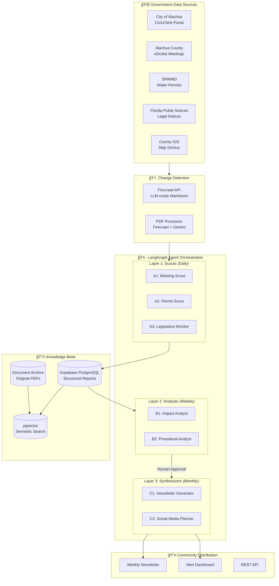
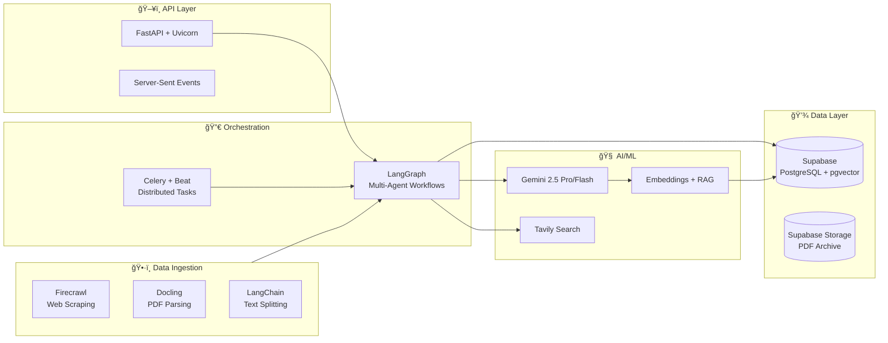

# 🏗️ Architecture

**Open Sousveillance Studio — Technical Architecture & System Design**

---

## Table of Contents

1. [System Overview](#system-overview)
2. [Intelligence Layer](#intelligence-layer)
3. [Three-Layer Agent Framework](#three-layer-agent-framework)
4. [Technology Stack](#technology-stack)
5. [Data Flow](#data-flow)
6. [Firecrawl Integration](#firecrawl-integration)
7. [Docling Integration](#docling-integration)
8. [Configuration System](#configuration-system)
9. [Monitored Data Sources](#monitored-data-sources)
10. [Streamlit Dev Console](#streamlit-dev-console)

---

## 🔭 System Overview

Open Sousveillance Studio deploys AI agents that watch 15+ government data sources, detect new documents within hours of publication, extract actionable intelligence, and generate weekly reports for community distribution.

### Core Design Principle

**Comprehensive Coverage + Priority Flagging**

The system documents ALL government activity, not just keyword matches. Watchlist items are *flagged* for priority attention, not used to *filter* what gets reported.

```mermaid
flowchart TB
    IC["⚙️ INSTANCE CONFIG<br/>(Municipality-specific: sources, entities, watchlists)"]
    AF["🤖 AGENT FRAMEWORK<br/>(Generic: Scout, Analyst patterns)"]
    LLM["🧠 LLM INTELLIGENCE<br/>(Dynamic: reasoning, pattern recognition, synthesis)"]

    IC --> AF --> LLM
```





---

## � Intelligence Layer

**Phase 3: Intelligent Evolution** introduces an event-driven architecture that unifies all scraper output into a single queryable model.

### Architecture Overview


### CivicEvent Model

The unified event model normalizes output from all scrapers:

```python
@dataclass
class CivicEvent:
    event_id: str              # Unique identifier
    event_type: EventType      # meeting, permit_application, permit_issued, public_notice
    source_id: str             # Which scraper produced this
    timestamp: datetime        # When the event occurs
    title: str                 # Human-readable title
    description: Optional[str]
    location: Optional[GeoLocation]
    entities: List[Entity]     # People, orgs, addresses (for linking)
    documents: List[Document]  # Attached files
    tags: List[str]            # For filtering (rezoning, environmental, etc.)
    content_hash: str          # For change detection
    raw_data: Dict             # Original source data
```

### EventStore Queries

| Method | Purpose |
|:-------|:--------|
| `save_event()` | Persist event, detect new/updated/unchanged |
| `get_whats_new(hours=24)` | Events discovered in last N hours |
| `get_upcoming(days=7)` | Future meetings and hearings |
| `get_events(source_id, tags, since)` | Filtered queries |
| `get_by_entity(name)` | Find events mentioning an entity |
| `get_by_county(county)` | Filter by geographic location |

### Watchdog Rules Engine

Rule-based alert generation for civic monitoring:

```yaml
# config/watchdog_rules.yaml
rules:
  - name: "rezoning-alert"
    severity: "notable"
    required_tags: ["rezoning"]
    message: "Rezoning activity: {title}"

  - name: "environmental-concern"
    severity: "warning"
    any_tags: ["water", "aquifer", "wetland"]
    message: "Environmental item: {title}"
```

**14 Default Rules** covering:
- Permit applications and issuances
- Rezoning and land use changes
- Environmental concerns (water, aquifer)
- Upcoming meetings and public hearings
- Development and annexation

### Source Adapters

| Adapter | Input | Output |
|:--------|:------|:-------|
| `CivicClerkAdapter` | Meeting data | CivicEvent with board entities, agenda docs |
| `SRWMDAdapter` | Permit notices | CivicEvent with project entities, location |
| `FloridaNoticesAdapter` | Public notices | CivicEvent with county, PDF documents |

---

## 🤖 Two-Layer Agent Framework

The system uses a **two-layer agent architecture** with the Orchestrator coordinating execution:

```mermaid
flowchart TB
    subgraph Orchestrator["🎯 Orchestrator (Daily 4 AM EST)"]
        direction TB
        SCHED[Celery Beat<br/>Scheduler]
        PIPE[Pipeline<br/>Coordinator]
    end

    subgraph Layer1["🔍 Layer 1: ScoutAgent"]
        direction LR
        SC[ScoutAgent]
        WL[Watchlist<br/>Matching]
    end

    subgraph Layer2["🧠 Layer 2: AnalystAgent"]
        direction LR
        AN[AnalystAgent]
        TAV[Tavily<br/>Fast Search]
        GEM[Gemini Deep<br/>Research]
    end

    subgraph Scrapers["🕷️ Scrapers"]
        CC[CivicClerk]
        SR[SRWMD]
        FN[Florida Notices]
    end

    SCHED --> PIPE
    PIPE --> Scrapers
    Scrapers --> Layer1
    Layer1 -->|relevance >= 0.7| Layer2
    Layer1 --> DB[(Supabase)]
    Layer2 --> DB
    AN --> TAV
    AN --> GEM
```



| Layer | Agent | Frequency | Purpose | Research Providers |
|:------|:------|:----------|:--------|:-------------------|
| **Layer 1** | `ScoutAgent` | Daily (4 AM) | Analyze scraped content against watchlist, generate relevance scores | Local LLM analysis |
| **Layer 2** | `AnalystAgent` | On-demand | Deep research on high-relevance items (≥0.7 score) | Tavily + Gemini Deep Research |

---

## 🛠️ Technology Stack



| Component | Technology | Purpose |
|:----------|:-----------|:--------|
| **Web Server** | FastAPI + Uvicorn | REST API, SSE streaming, approval endpoints |
| **Orchestration** | LangGraph | Multi-agent workflows with human-in-the-loop |
| **Scheduling** | Celery + Celery Beat | Distributed task queue with cron scheduling |
| **LLM** | Gemini 2.5 Pro & Flash | Pro for reasoning, Flash for extraction |
| **Search** | Tavily | AI-optimized web research |
| **Database** | Supabase (PostgreSQL) | Structured data, JSONB, pgvector |
| **Document Storage** | Supabase Storage | PDF archive with full traceability |
| **Validation** | Pydantic v2 | Strict schemas for all data |
| **Web Scraping** | Firecrawl | LLM-ready markdown, JS rendering, batch operations |
| **Document Parsing** | Docling | PDF/DOCX parsing, table extraction, layout understanding |
| **Dev Console** | Streamlit | Interactive testing and debugging UI |

---

## 🔄 Data Flow

```mermaid
sequenceDiagram
    participant CRON as ⏰ Celery Beat
    participant ORCH as 🎯 Orchestrator
    participant SCRAPER as 🕷️ Scraper
    participant SRC as 🌐 CivicClerk
    participant PDF as 📄 PDF Processor
    participant DB as 💾 Supabase
    participant SCOUT as 🔍 ScoutAgent
    participant ANALYST as 🧠 AnalystAgent
    participant TAV as � Tavily
    participant GEM as 🤖 Gemini Deep Research

    CRON->>ORCH: Daily trigger (4 AM EST)
    ORCH->>SCRAPER: Run hybrid pipeline
    SCRAPER->>SRC: Fetch meeting list (Firecrawl)
    SRC-->>SCRAPER: Markdown + event IDs
    SCRAPER->>SRC: Fetch event files pages
    SRC-->>SCRAPER: PDF URLs
    SCRAPER->>PDF: Download PDFs
    PDF-->>SCRAPER: Extracted text
    SCRAPER->>DB: Sync meetings (new/updated/unchanged)

    Note over DB: Deduplicate via content hash

    ORCH->>SCOUT: Analyze new items
    SCOUT->>SCOUT: Match against watchlist
    SCOUT->>DB: Store ScoutReport + relevance score

    Note over SCOUT: If relevance >= 0.7, trigger Layer 2

    ORCH->>ANALYST: Deep research on high-relevance items
    ANALYST->>TAV: Tavily fast search
    TAV-->>ANALYST: Web results
    ANALYST->>GEM: Gemini Deep Research
    GEM-->>ANALYST: Comprehensive analysis
    ANALYST->>DB: Store DeepResearchReport

    Note over ORCH: Manual runs available via Streamlit UI or CLI
```



---

## 🕷️ Firecrawl Integration

Open Sousveillance Studio uses **[Firecrawl](https://firecrawl.dev)** as its primary web scraping engine. Firecrawl handles the complexity of modern government portals (JavaScript SPAs, anti-bot measures, dynamic content) and returns clean, LLM-ready data.

### Why Firecrawl?

| Challenge | Firecrawl Solution |
|:----------|:-------------------|
| **React/Angular SPAs** | Full JavaScript rendering with configurable wait times |
| **Dynamic content** | Actions API: click, scroll, wait before scraping |
| **PDF documents** | Native PDF text extraction (staff reports, agendas) |
| **Rate limiting** | Built-in caching (2-day default), batch operations |
| **Anti-bot measures** | Managed proxies and stealth mode |
| **LLM integration** | Returns markdown optimized for AI processing |

### Key Features

```python
from firecrawl import Firecrawl

firecrawl = Firecrawl(api_key="fc-YOUR-API-KEY")

# 1. SCRAPE: Get a single meeting page as markdown
doc = firecrawl.scrape(
    "https://alachuafl.portal.civicclerk.com/event/849/overview",
    formats=["markdown", "links"],
    actions=[
        {"type": "wait", "milliseconds": 2000},  # Wait for React to render
        {"type": "scroll", "direction": "down"}   # Load lazy content
    ]
)

# 2. MAP: Discover all meeting URLs on the portal
urls = firecrawl.map(
    url="https://alachuafl.portal.civicclerk.com",
    search="meeting",  # Filter to meeting-related pages
    limit=100
)

# 3. BATCH SCRAPE: Fetch multiple meetings efficiently
results = firecrawl.batch_scrape(
    urls=["https://...meeting1", "https://...meeting2"],
    formats=["markdown"]
)
```

### Scraping Strategy by Source

| Source | Method | Actions Required | Output |
|:-------|:-------|:-----------------|:-------|
| **CivicClerk** (City of Alachua) | `scrape` + actions | `wait` 2s, `scroll` down | Markdown + links |
| **Florida Public Notices** | `scrape` | None (static) | Markdown |
| **eScribe** (County) | `scrape` + actions | `wait` for selector | Markdown + PDF links |
| **PDF Agendas** | `scrape` with `parsers=["pdf"]` | None | Extracted text |

### Cost Estimation

| Plan | Credits/Month | Cost | Sufficient For |
|:-----|:--------------|:-----|:---------------|
| **Free** | 500 | $0 | Testing, ~16 scrapes/day |
| **Hobby** | 3,000 | $16/mo | Production monitoring (~100/day) |
| **Standard** | 100,000 | $99/mo | Multi-jurisdiction deployment |

---

## 📄 Docling Integration

For PDF and document parsing, we use **[Docling](https://github.com/docling-project/docling)** (IBM's open-source document processor). Docling excels at extracting structured content from complex government documents.

### Why Docling?

| Challenge | Docling Solution |
|:----------|:-----------------|
| **Complex PDF layouts** | Advanced layout understanding, reading order detection |
| **Tables in staff reports** | Structure-preserving table extraction |
| **Multi-format support** | PDF, DOCX, PPTX, HTML, images |
| **Scanned documents** | Built-in OCR support |
| **Data privacy** | 100% local execution (no API calls) |

### Usage with LangChain

```python
from docling.document_converter import DocumentConverter
from langchain.text_splitter import RecursiveCharacterTextSplitter

# 1. Parse PDF with Docling
converter = DocumentConverter()
result = converter.convert("staff_report.pdf")
markdown = result.document.export_to_markdown()

# 2. Chunk with LangChain
splitter = RecursiveCharacterTextSplitter(
    chunk_size=512,
    chunk_overlap=50,
    separators=["\n\n", "\n", ". ", " "]
)
chunks = splitter.split_text(markdown)

# 3. Ready for embedding and storage
```

---

## ⚙️ Configuration System

Open Sousveillance Studio uses a **modular YAML configuration system** that makes it easy to deploy for any US municipality without code changes.

### Configuration Files

| File | Purpose | Key Settings |
|:-----|:--------|:-------------|
| `config/instance.yaml` | Your deployment identity | Instance name, jurisdiction hierarchy, timezone, schedules |
| `config/sources.yaml` | Government data sources | URLs, scraping methods, document types, board filters |
| `config/entities.yaml` | Watchlist items to FLAG | Projects, organizations, people, keywords (priority tiers) |
| `config/civic_categories.yaml` | Universal civic categories | 12 categories shared across all instances |

### Priority Tiers (entities.yaml)

Entities use priority tiers instead of urgency colors:

| Tier | Meaning | Example |
|:-----|:--------|:--------|
| `critical` | Immediate attention, potential citizen action | Active development threatening water supply |
| `high` | Important to track closely, may escalate | Permit applications, key officials |
| `medium` | Worth monitoring, background awareness | Government bodies, routine tracking |
| `low` | Informational, allies, or general context | Advocacy groups, coalition partners |

### Civic Categories (civic_categories.yaml)

Universal categories applicable to any municipality:

| Category | Description |
|:---------|:------------|
| `budget_finance` | Budgets, taxes, appropriations, audits |
| `land_use` | Zoning, plats, comprehensive plan |
| `public_safety` | Police, fire, emergency services |
| `infrastructure` | Roads, utilities, maintenance |
| `personnel` | Hiring, salaries, HR matters |
| `contracts` | Bids, RFPs, vendor agreements |
| `environment` | Environmental protection, permits |
| `public_hearing` | Quasi-judicial, public comment |
| `consent` | Consent agenda items |
| `intergovernmental` | County/state/federal coordination |
| `community` | Events, proclamations, recognition |
| `other` | Uncategorized items |

### Instance Configuration (`instance.yaml`)

```yaml
instance:
  id: "alachua-fl"
  name: "Alachua County Civic Watch"
  timezone: "America/New_York"
  operator:
    name: "Our Alachua Water Coalition"
    email: "contact@ouralachuawater.org"

jurisdiction:
  country: "US"
  state: "FL"
  county: "Alachua"
  municipalities:
    - name: "City of Alachua"
      primary: true
    - name: "City of High Springs"
      primary: false

schedule:
  scouts:
    enabled: true
    cron: "0 4 * * *"  # Daily at 4 AM
  analysts:
    enabled: true
    cron: "0 9 * * 1"  # Weekly on Monday
    requires_approval: true
```

### Sources Configuration (`sources.yaml`)

```yaml
tier_1_municipal:
  - id: "alachua-civicclerk"
    name: "City of Alachua - Meeting Portal"
    url: "https://alachuafl.portal.civicclerk.com/"
    platform: "civicclerk"
    priority: "critical"
    scraping:
      method: "playwright"
      requires_javascript: true
      wait_for_selector: ".meeting-list"
    document_types:
      - "agenda"
      - "minutes"
    boards:
      - name: "City Commission"
        keywords: ["commission"]
        priority: "critical"
```

### Entities Configuration (`entities.yaml`)

```yaml
# Instance metadata
instance:
  name: "Alachua Civic Intelligence"
  municipality: "City of Alachua"
  county: "Alachua County"
  state: "Florida"

projects:
  - id: "tara-portfolio"
    name: "Tara Development Portfolio"
    priority: "critical"  # Flags items for priority review
    aliases:
      - "Tara Forest"
      - "Tara Baywood"
    keywords:
      - "Mill Creek"
      - "PSE22-0002"

organizations:
  - id: "tara-forest-llc"
    name: "Tara Forest, LLC"
    type: "developer"
    priority: "critical"

  - id: "our-alachua-water"
    name: "Our Alachua Water"
    type: "advocacy"
    priority: "low"  # Ally - informational

topics:
  - id: "karst-geology"
    name: "Karst Geology"
    priority: "critical"
    keywords:
      - "karst"
      - "sinkhole"
      - "cave"
      - "aquifer"
```

### Using Configuration in Code

```python
from src.config import build_app_config
from src.prompts.loader import get_config_loader

# Load complete configuration
config = build_app_config()
print(config.instance.name)  # "Alachua County Civic Watch"
print(config.jurisdiction.state)  # "FL"

# Load watchlist from YAML config
config_loader = get_config_loader()

# Get all keywords for watchlist matching
keywords = config_loader.get_all_watchlist_keywords()
print(f"Tracking {len(keywords)} keywords")

# Get entities by priority tier
critical_entities = config_loader.get_priority_entities("critical")
for entity in critical_entities:
    print(f"CRITICAL: {entity['name']}")

# Load civic categories
categories = config_loader.load_civic_categories()
for cat_id, cat_info in categories['categories'].items():
    print(f"{cat_info['icon']} {cat_info['name']}")
```

---

## 📍 Monitored Data Sources

Open Sousveillance Studio is designed to be **location-agnostic**. The source registry can be configured for any municipality. Below is the default configuration for Alachua County, Florida:

| Tier | Source | Platform | Priority | Scraping Method |
|:-----|:-------|:---------|:---------|:----------------|
| **1** | City of Alachua Meetings | CivicClerk (SPA) | 🔴 Critical | Playwright + XHR interception |
| **1** | Development Projects Map | Granicus CMS | 🔴 Critical | BeautifulSoup |
| **2** | Alachua County Meetings | eScribe | 🔴 Critical | Playwright + PDF download |
| **2** | Map Genius (Projects) | County GIS | 🔴 Critical | JSON API |
| **3** | SRWMD Water Permits | E-Permitting Portal | 🔴 Critical | Form submission + scrape |
| **4** | Florida Public Notices | Statewide Repository | 🔴 Critical | Filter by county + parse |
| **5** | WUFT Environment News | WordPress | 🟡 High | RSS feed |

---

## 🔬 Streamlit Dev Console

A browser-based testing interface for debugging agents and inspecting prompts.

```bash
streamlit run src/ui/app.py
# Opens at http://localhost:8501
```


### Dev Console Features

| Tab | Purpose |
|:----|:--------|
| **🤖 Agent Runner** | Execute Scout/Analyst agents with custom URLs, view structured reports |
| **📝 Prompt Inspector** | Browse prompt library, view injected domain context |
| **🌐 Source Tester** | Test web scraping on sources from `config/sources.yaml` |
| **⚙️ Config Viewer** | Inspect YAML configs and environment variable status |

---

## 📁 Project Structure

```
open-sousveillance-studio/
├── config/                     # YAML configuration files
│   ├── instance.yaml           # Instance identity & scheduling
│   ├── sources.yaml            # Government data sources
│   ├── entities.yaml           # Watchlist (projects, orgs, keywords)
│   ├── watchdog_rules.yaml     # 🆕 Civic alert rules (14 rules)
│   ├── discovered_resources.yaml # 🆕 Resource ID cache
│   └── source_playbooks/       # 🆕 Source-specific playbooks
│
├── src/                        # Application source code
│   ├── agents/                 # AI agent implementations
│   │   ├── base.py             # BaseAgent abstract class
│   │   ├── scout.py            # Layer 1: Scout agents (A1-A4)
│   │   └── analyst.py          # Layer 2: Analyst agents (B1-B2)
│   │
│   ├── intelligence/           # 🆕 Event-driven intelligence layer
│   │   ├── models.py           # CivicEvent, Entity, Document, Alert
│   │   ├── event_store.py      # Persistence + queries
│   │   ├── rules_engine.py     # Watchdog alert generation
│   │   └── adapters/           # Source → CivicEvent converters
│   │       ├── base_adapter.py
│   │       ├── civicclerk_adapter.py
│   │       ├── srwmd_adapter.py
│   │       └── florida_notices_adapter.py
│   │
│   ├── api/                    # FastAPI routes
│   │   └── routes/
│   │       ├── workflows.py    # POST /run, GET /status
│   │       ├── approvals.py    # Human-in-the-loop endpoints
│   │       └── streaming.py    # SSE real-time updates
│   │
│   ├── tasks/                  # Celery background tasks
│   │   ├── celery_app.py       # Celery configuration
│   │   └── scout_tasks.py      # Scout task definitions
│   │
│   ├── tools/                  # External service wrappers
│   │   ├── firecrawl_client.py # Web scraping
│   │   ├── civicclerk_scraper.py # CivicClerk portal scraper
│   │   ├── srwmd_scraper.py    # SRWMD permit scraper
│   │   ├── florida_notices_scraper.py # Public notices scraper
│   │   ├── gemini_research.py  # 🆕 Gemini Deep Research client
│   │   ├── resource_cache.py   # Discovered resources cache
│   │   └── docling_processor.py# PDF parsing
│   │
│   ├── workflows/              # LangGraph workflows
│   │   └── graphs.py           # Workflow definitions
│   │
│   ├── ui/                     # Streamlit Dev Console
│   │   ├── app.py              # Main Streamlit app
│   │   └── pages/              # Tab pages
│   │
│   ├── app.py                  # FastAPI application
│   ├── orchestrator.py         # 🆕 Pipeline coordinator
│   ├── config.py               # Configuration loader
│   ├── database.py             # Supabase client
│   ├── schemas.py              # Pydantic models
│   └── models.py               # LLM configuration
│
├── scripts/                    # 🆕 Utility scripts
│   ├── discover_sitemaps.py    # Source URL discovery
│   └── analyze_sources.py      # Playbook generator
│
├── prompt_library/             # Agent prompt templates
│   ├── config/                 # Domain context files
│   ├── layer-1-scouts/         # A1-A4 prompts
│   ├── layer-2-analysts/       # B1-B2 prompts
│   └── layer-3-synthesizers/   # C1-C4 prompts
│
├── test/                       # Test files (78 tests)
│   ├── test_scrapers.py        # Scraper tests (39)
│   └── test_intelligence.py    # Intelligence tests (39)
│
├── docs/                       # Documentation
├── data/                       # Generated reports
│
├── docker-compose.yml          # Multi-service orchestration
├── Dockerfile                  # Container image
├── requirements.txt            # Python dependencies
└── .env.example                # Environment template
```

---

*For setup instructions, see [README.md](../README.md). For development guide, see [DEVELOPER_GUIDE.md](DEVELOPER_GUIDE.md).*

*Last updated: February 5, 2026*
