# Project Management: Open Sousveillance Studio

**Version:** 1.0  
**Last Updated:** 2026-01-29  
**Project Lead:** Hans

---

## How to Use This Document

This document tracks all work items in a format similar to Azure DevOps boards:

- **Epics** - Large bodies of work spanning multiple sprints
- **Features** - Deliverable functionality within an epic
- **User Stories** - User-focused requirements (As a... I want... So that...)
- **Tasks** - Specific implementation work items

### Status Legend

| Status | Symbol | Description |
|:-------|:-------|:------------|
| Backlog | 📋 | Not started, in queue |
| Ready | 🔵 | Ready to start |
| In Progress | 🟡 | Currently being worked on |
| In Review | 🟣 | Awaiting review/testing |
| Done | ✅ | Completed |
| Blocked | 🔴 | Blocked by dependency |

### Priority Legend

| Priority | Symbol |
|:---------|:-------|
| Critical | 🔴 |
| High | 🟠 |
| Medium | 🟡 |
| Low | 🟢 |

---

## Epic Overview

| ID | Epic | Status | Progress |
|:---|:-----|:-------|:---------|
| E1 | Foundation & Infrastructure | ✅ Done | 100% |
| E2 | Scout Layer (Data Collection) | 🟡 In Progress | 40% |
| E3 | Analyst Layer (Intelligence) | 📋 Backlog | 0% |
| E4 | Synthesizer Layer (Output) | 📋 Backlog | 0% |
| E5 | Integration & Deployment | 📋 Backlog | 0% |

### Epic Progress Chart

### Epic Dependencies

```mermaid
flowchart LR
    E1[E1: Foundation ✅] --> E2[E2: Scout Layer 🟡]
    E2 --> E3[E3: Analyst Layer]
    E3 --> E4[E4: Synthesizer]
    E2 --> E5[E5: Integration]
    E3 --> E5
    E4 --> E5
```

---

## E1: Foundation & Infrastructure ✅

**Status:** Done  
**Sprint:** 1-2 (Jan 1-20)  
**Owner:** Hans

### Features

#### F1.1: Project Structure ✅

| ID | User Story | Status | Priority |
|:---|:-----------|:-------|:---------|
| US1.1.1 | As a developer, I want a clear project structure so that I can navigate the codebase easily | ✅ | 🟠 |
| US1.1.2 | As a developer, I want Pydantic schemas so that data is validated consistently | ✅ | 🟠 |

**Tasks:**

| ID | Task | Status | Estimate |
|:---|:-----|:-------|:---------|
| T1.1.1 | Create directory structure | ✅ | 1h |
| T1.1.2 | Create src/schemas.py with core models | ✅ | 2h |
| T1.1.3 | Create src/config.py with YAML loading | ✅ | 4h |
| T1.1.4 | Create config/*.yaml files | ✅ | 4h |

#### F1.2: Database Integration ✅

| ID | User Story | Status | Priority |
|:---|:-----------|:-------|:---------|
| US1.2.1 | As a system, I want to persist reports to Supabase so that data is not lost | ✅ | 🔴 |

**Tasks:**

| ID | Task | Status | Estimate |
|:---|:-----|:-------|:---------|
| T1.2.1 | Create src/database.py | ✅ | 2h |
| T1.2.2 | Implement save_report() | ✅ | 2h |
| T1.2.3 | Create Supabase tables | ✅ | 1h |

#### F1.3: Documentation ✅

| ID | User Story | Status | Priority |
|:---|:-----------|:-------|:---------|
| US1.3.1 | As a contributor, I want comprehensive README so that I can understand the project | ✅ | 🟡 |
| US1.3.2 | As an operator, I want prompt templates so that agents behave consistently | ✅ | 🟠 |

**Tasks:**

| ID | Task | Status | Estimate |
|:---|:-----|:-------|:---------|
| T1.3.1 | Write README.md | ✅ | 4h |
| T1.3.2 | Create prompt_library/ structure | ✅ | 2h |
| T1.3.3 | Write A1-A4 scout prompts | ✅ | 4h |
| T1.3.4 | Write B1-B2 analyst prompts | ✅ | 2h |

---

## E2: Scout Layer (Data Collection) 🟡

**Status:** In Progress  
**Sprint:** 3-4 (Jan 21 - Feb 15)  
**Owner:** Hans

### Features

#### F2.1: Web Scraping Infrastructure ✅

| ID | User Story | Status | Priority |
|:---|:-----------|:-------|:---------|
| US2.1.1 | As a scout, I want to scrape JS-rendered pages so that I can monitor React SPAs | ✅ | 🔴 |
| US2.1.2 | As a scout, I want to extract PDF content so that I can analyze agenda packets | ✅ | 🔴 |

**Tasks:**

| ID | Task | Status | Estimate |
|:---|:-----|:-------|:---------|
| T2.1.1 | Create src/tools/firecrawl_client.py | ✅ | 4h |
| T2.1.2 | Implement scrape_page() with retry logic | ✅ | 2h |
| T2.1.3 | Implement scrape_civicclerk() specialized method | ✅ | 2h |
| T2.1.4 | Create src/tools/docling_processor.py | ✅ | 4h |
| T2.1.5 | Implement PDF chunking with LangChain | ✅ | 2h |

#### F2.2: CivicClerk Scraper 🟡

| ID | User Story | Status | Priority |
|:---|:-----------|:-------|:---------|
| US2.2.1 | As a citizen, I want daily updates from City of Alachua meetings so that I don't miss important votes | 🟡 | 🔴 |

**Tasks:**

| ID | Task | Status | Estimate |
|:---|:-----|:-------|:---------|
| T2.2.1 | Analyze CivicClerk page structure | 📋 | 2h |
| T2.2.2 | Implement meeting list extraction | 📋 | 4h |
| T2.2.3 | Implement agenda item parsing | 📋 | 4h |
| T2.2.4 | Implement PDF packet download | 📋 | 2h |
| T2.2.5 | Add board filtering (Commission, PZB, CRA) | 📋 | 2h |
| T2.2.6 | Write integration tests | 📋 | 4h |

#### F2.3: eScribe Scraper 📋

| ID | User Story | Status | Priority |
|:---|:-----------|:-------|:---------|
| US2.3.1 | As a citizen, I want updates from Alachua County meetings so that I can track county-level decisions | 📋 | 🔴 |

**Tasks:**

| ID | Task | Status | Estimate |
|:---|:-----|:-------|:---------|
| T2.3.1 | Analyze eScribe page structure | 📋 | 2h |
| T2.3.2 | Implement meeting list extraction | 📋 | 4h |
| T2.3.3 | Implement agenda parsing | 📋 | 4h |
| T2.3.4 | Add DRC and BOCC filters | 📋 | 2h |
| T2.3.5 | Write integration tests | 📋 | 4h |

#### F2.4: Florida Public Notices Scraper 📋

| ID | User Story | Status | Priority |
|:---|:-----------|:-------|:---------|
| US2.4.1 | As a citizen, I want to monitor legal notices so that I catch public hearings and deadlines | 📋 | 🟠 |

**Tasks:**

| ID | Task | Status | Estimate |
|:---|:-----|:-------|:---------|
| T2.4.1 | Analyze floridapublicnotices.com structure | 📋 | 2h |
| T2.4.2 | Implement county filter | 📋 | 2h |
| T2.4.3 | Implement notice extraction | 📋 | 4h |
| T2.4.4 | Write integration tests | 📋 | 2h |

#### F2.5: Task Scheduling ✅

| ID | User Story | Status | Priority |
|:---|:-----------|:-------|:---------|
| US2.5.1 | As an operator, I want scouts to run automatically so that monitoring is 24/7 | ✅ | 🔴 |

**Tasks:**

| ID | Task | Status | Estimate |
|:---|:-----|:-------|:---------|
| T2.5.1 | Create src/tasks/celery_app.py | ✅ | 2h |
| T2.5.2 | Configure beat schedule | ✅ | 1h |
| T2.5.3 | Create src/tasks/scout_tasks.py | ✅ | 2h |
| T2.5.4 | Implement run_all_critical_scouts() | ✅ | 2h |

#### F2.6: Change Detection 📋

| ID | User Story | Status | Priority |
|:---|:-----------|:-------|:---------|
| US2.6.1 | As a system, I want to detect changes so that I don't process duplicate content | 📋 | 🟠 |

**Tasks:**

| ID | Task | Status | Estimate |
|:---|:-----|:-------|:---------|
| T2.6.1 | Implement content hashing | 📋 | 2h |
| T2.6.2 | Add hash storage to database | 📋 | 2h |
| T2.6.3 | Implement deduplication logic | 📋 | 2h |
| T2.6.4 | Write unit tests | 📋 | 2h |

---

## E3: Analyst Layer (Intelligence) 📋

**Status:** Backlog  
**Sprint:** 5-6 (Feb 16 - Mar 15)  
**Owner:** Hans

### Features

#### F3.1: LangGraph Workflows 🔵

| ID | User Story | Status | Priority |
|:---|:-----------|:-------|:---------|
| US3.1.1 | As a system, I want stateful workflows so that long-running analyses can be resumed | 🔵 | 🔴 |

**Tasks:**

| ID | Task | Status | Estimate |
|:---|:-----|:-------|:---------|
| T3.1.1 | Create src/workflows/graphs.py | ✅ | 4h |
| T3.1.2 | Implement Scout workflow | ✅ | 2h |
| T3.1.3 | Implement Analyst workflow | ✅ | 4h |
| T3.1.4 | Create Supabase checkpointer | 📋 | 4h |
| T3.1.5 | Add workflow state persistence | 📋 | 4h |

#### F3.2: Deep Research Integration 📋

| ID | User Story | Status | Priority |
|:---|:-----------|:-------|:---------|
| US3.2.1 | As an analyst, I want to search the web so that I can find connections and context | 📋 | 🟠 |

**Tasks:**

| ID | Task | Status | Estimate |
|:---|:-----|:-------|:---------|
| T3.2.1 | Enhance Tavily integration | 📋 | 2h |
| T3.2.2 | Implement query generation | 📋 | 2h |
| T3.2.3 | Add result ranking | 📋 | 2h |
| T3.2.4 | Write integration tests | 📋 | 2h |

#### F3.3: Human-in-the-Loop Approval 🔵

| ID | User Story | Status | Priority |
|:---|:-----------|:-------|:---------|
| US3.3.1 | As an operator, I want to approve analyst reports before publication so that I maintain quality control | 🔵 | 🔴 |

**Tasks:**

| ID | Task | Status | Estimate |
|:---|:-----|:-------|:---------|
| T3.3.1 | Create approval API endpoints | ✅ | 2h |
| T3.3.2 | Implement LangGraph interrupt() | 📋 | 4h |
| T3.3.3 | Add email notification on pending | 📋 | 2h |
| T3.3.4 | Implement approval resume logic | 📋 | 4h |
| T3.3.5 | Write E2E tests | 📋 | 4h |

#### F3.4: Pattern Recognition 📋

| ID | User Story | Status | Priority |
|:---|:-----------|:-------|:---------|
| US3.4.1 | As an analyst, I want to identify patterns across reports so that I can surface trends | 📋 | 🟡 |

**Tasks:**

| ID | Task | Status | Estimate |
|:---|:-----|:-------|:---------|
| T3.4.1 | Implement embedding generation | 📋 | 2h |
| T3.4.2 | Add pgvector similarity search | 📋 | 4h |
| T3.4.3 | Create pattern detection prompts | 📋 | 2h |
| T3.4.4 | Write unit tests | 📋 | 2h |

---

## E4: Synthesizer Layer (Output) 📋

**Status:** Backlog  
**Sprint:** Post v1.0 (v1.1)  
**Owner:** Hans

### Features

#### F4.1: Newsletter Generation 📋

| ID | User Story | Status | Priority |
|:---|:-----------|:-------|:---------|
| US4.1.1 | As a citizen, I want weekly email digests so that I stay informed without checking daily | 📋 | 🟡 |

**Tasks:**

| ID | Task | Status | Estimate |
|:---|:-----|:-------|:---------|
| T4.1.1 | Create MJML email templates | 📋 | 4h |
| T4.1.2 | Integrate Resend API | 📋 | 2h |
| T4.1.3 | Implement digest generation | 📋 | 4h |
| T4.1.4 | Add subscriber management | 📋 | 4h |

#### F4.2: Social Media Content 📋

| ID | User Story | Status | Priority |
|:---|:-----------|:-------|:---------|
| US4.2.1 | As a coalition, I want shareable social content so that we can spread awareness | 📋 | 🟢 |

**Tasks:**

| ID | Task | Status | Estimate |
|:---|:-----|:-------|:---------|
| T4.2.1 | Create Twitter/X thread templates | 📋 | 2h |
| T4.2.2 | Create Facebook post templates | 📋 | 2h |
| T4.2.3 | Implement content generation | 📋 | 4h |

---

## E5: Integration & Deployment 📋

**Status:** Backlog  
**Sprint:** 7 (Mar 16 - Apr 1)  
**Owner:** Hans

### Features

#### F5.1: Docker Deployment 📋

| ID | User Story | Status | Priority |
|:---|:-----------|:-------|:---------|
| US5.1.1 | As an operator, I want Docker deployment so that setup is reproducible | 📋 | 🟠 |

**Tasks:**

| ID | Task | Status | Estimate |
|:---|:-----|:-------|:---------|
| T5.1.1 | Create Dockerfile | 📋 | 2h |
| T5.1.2 | Create docker-compose.yml | 📋 | 2h |
| T5.1.3 | Write deployment documentation | 📋 | 2h |
| T5.1.4 | Test on clean environment | 📋 | 4h |

#### F5.2: Testing Suite 📋

| ID | User Story | Status | Priority |
|:---|:-----------|:-------|:---------|
| US5.2.1 | As a developer, I want automated tests so that I can refactor with confidence | 📋 | 🟠 |

**Tasks:**

| ID | Task | Status | Estimate |
|:---|:-----|:-------|:---------|
| T5.2.1 | Set up pytest infrastructure | 📋 | 2h |
| T5.2.2 | Write unit tests for config | 📋 | 2h |
| T5.2.3 | Write unit tests for schemas | 📋 | 2h |
| T5.2.4 | Write integration tests for API | 📋 | 4h |
| T5.2.5 | Write E2E workflow tests | 📋 | 4h |

#### F5.3: Monitoring & Logging 📋

| ID | User Story | Status | Priority |
|:---|:-----------|:-------|:---------|
| US5.3.1 | As an operator, I want structured logging so that I can debug issues | 📋 | 🟡 |

**Tasks:**

| ID | Task | Status | Estimate |
|:---|:-----|:-------|:---------|
| T5.3.1 | Configure Python logging | 📋 | 2h |
| T5.3.2 | Add request logging middleware | 📋 | 2h |
| T5.3.3 | Add Celery task logging | 📋 | 2h |

---

## Sprint Backlog

### Current Sprint: Sprint 3 (Jan 21 - Feb 3)

| ID | Task | Feature | Status | Assignee |
|:---|:-----|:--------|:-------|:---------|
| T2.2.1 | Analyze CivicClerk page structure | F2.2 | 🔵 Ready | Hans |
| T2.2.2 | Implement meeting list extraction | F2.2 | 📋 Backlog | Hans |
| T2.2.3 | Implement agenda item parsing | F2.2 | 📋 Backlog | Hans |
| T2.6.1 | Implement content hashing | F2.6 | 📋 Backlog | Hans |

### Sprint Velocity

| Sprint | Planned | Completed | Velocity |
|:-------|:--------|:----------|:---------|
| Sprint 1 | 20h | 20h | 100% |
| Sprint 2 | 24h | 24h | 100% |
| Sprint 3 | 24h | - | - |

---

## Blocked Items

| ID | Item | Blocked By | Notes |
|:---|:-----|:-----------|:------|
| - | None currently | - | - |

---

## Risk Register

| ID | Risk | Likelihood | Impact | Mitigation | Owner |
|:---|:-----|:-----------|:-------|:-----------|:------|
| R1 | CivicClerk blocks scraping | Medium | High | Use Firecrawl stealth, rate limit | Hans |
| R2 | Gemini API rate limits | Low | Medium | Implement backoff, cache results | Hans |
| R3 | Scope creep | High | Medium | Strict MVP scope, defer to v1.1 | Hans |

---

## Decision Log

| Date | Decision | Rationale | Decided By |
|:-----|:---------|:----------|:-----------|
| 2026-01-29 | Use Celery over APScheduler | Distributed task support, better for production | Hans |
| 2026-01-29 | Use Firecrawl over Playwright | Managed service, handles anti-bot, returns markdown | Hans |
| 2026-01-29 | Use Docling over pdfplumber | Better table extraction, IBM-backed, local execution | Hans |
| 2026-01-29 | Use LangGraph over custom | State management, checkpointing, human-in-loop built-in | Hans |

---

## Meeting Notes

### 2026-01-29: Architecture Review

- Completed code review of entire codebase
- Identified and fixed all P0/P1 issues
- Created project documentation suite
- Next: Begin CivicClerk scraper implementation

---

## Appendix: Task Estimation Guide

| Size | Hours | Description |
|:-----|:------|:------------|
| XS | 1h | Trivial change, config update |
| S | 2h | Simple feature, single file |
| M | 4h | Moderate feature, multiple files |
| L | 8h | Complex feature, new subsystem |
| XL | 16h+ | Major feature, requires design |

---

## Quick Links

- [PROJECT_PLAN.md](./PROJECT_PLAN.md) - High-level roadmap
- [SPEC.md](./SPEC.md) - Technical specification
- [TODO.md](../TODO.md) - Development task list
- [README.md](../README.md) - Project overview
