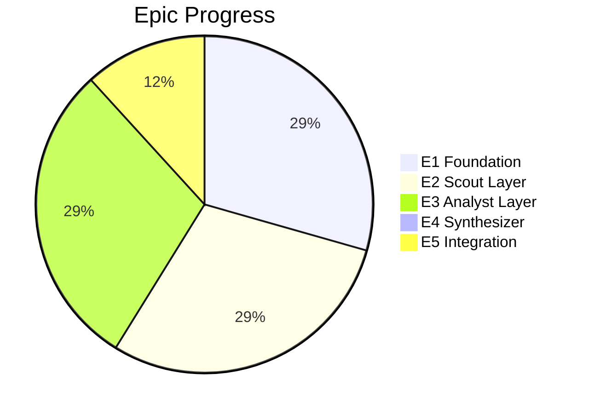

# Project Management: Open Sousveillance Studio

**Version:** 1.1
**Last Updated:** 2026-02-05
**Project Lead:** Hans

---

## How to Use This Document

This document tracks all work items in a format similar to Azure DevOps boards:

- **Epics** - Large bodies of work spanning multiple sprints
- **Features** - Deliverable functionality within an epic
- **User Stories** - User-focused requirements (As a... I want... So that...)
- **Tasks** - Specific implementation work items

### Status Legend

| Status | Symbol | Description |
|:-------|:-------|:------------|
| Backlog | 📋 | Not started, in queue |
| Ready | 🔵 | Ready to start |
| In Progress | 🟡 | Currently being worked on |
| In Review | 🟣 | Awaiting review/testing |
| Done | ✅ | Completed |
| Blocked | 🔴 | Blocked by dependency |

### Priority Legend

| Priority | Symbol |
|:---------|:-------|
| Critical | 🔴 |
| High | 🟠 |
| Medium | 🟡 |
| Low | 🟢 |

---

## Epic Overview

| ID | Epic | Status | Progress |
|:---|:-----|:-------|:---------|
| E1 | Foundation & Infrastructure | ✅ Done | 100% |
| E2 | Scout Layer (Data Collection) | ✅ Done | 100% |
| E3 | Analyst Layer (Intelligence) | ✅ Done | 100% |
| E4 | Synthesizer Layer (Output) | 📋 Backlog | 0% |
| E5 | Integration & Deployment | 🟡 In Progress | 40% |

### Epic Progress Chart

### Epic Dependencies

```mermaid
flowchart LR
    E1[E1: Foundation ✅] --> E2[E2: Scout Layer ✅]
    E2 --> E3[E3: Analyst Layer ✅]
    E3 --> E4[E4: Synthesizer]
    E2 --> E5[E5: Integration 🟡]
    E3 --> E5
    E4 --> E5
```

---

## E1: Foundation & Infrastructure ✅

**Status:** Done
**Sprint:** 1-2 (Jan 1-20)
**Owner:** Hans

### Features

#### F1.1: Project Structure ✅

| ID | User Story | Status | Priority |
|:---|:-----------|:-------|:---------|
| US1.1.1 | As a developer, I want a clear project structure so that I can navigate the codebase easily | ✅ | 🟠 |
| US1.1.2 | As a developer, I want Pydantic schemas so that data is validated consistently | ✅ | 🟠 |

**Tasks:**

| ID | Task | Status | Estimate |
|:---|:-----|:-------|:---------|
| T1.1.1 | Create directory structure | ✅ | 1h |
| T1.1.2 | Create src/schemas.py with core models | ✅ | 2h |
| T1.1.3 | Create src/config.py with YAML loading | ✅ | 4h |
| T1.1.4 | Create config/*.yaml files | ✅ | 4h |

#### F1.2: Database Integration ✅

| ID | User Story | Status | Priority |
|:---|:-----------|:-------|:---------|
| US1.2.1 | As a system, I want to persist reports to Supabase so that data is not lost | ✅ | 🔴 |

**Tasks:**

| ID | Task | Status | Estimate |
|:---|:-----|:-------|:---------|
| T1.2.1 | Create src/database.py | ✅ | 2h |
| T1.2.2 | Implement save_report() | ✅ | 2h |
| T1.2.3 | Create Supabase tables | ✅ | 1h |

#### F1.3: Documentation ✅

| ID | User Story | Status | Priority |
|:---|:-----------|:-------|:---------|
| US1.3.1 | As a contributor, I want comprehensive README so that I can understand the project | ✅ | 🟡 |
| US1.3.2 | As an operator, I want prompt templates so that agents behave consistently | ✅ | 🟠 |

**Tasks:**

| ID | Task | Status | Estimate |
|:---|:-----|:-------|:---------|
| T1.3.1 | Write README.md | ✅ | 4h |
| T1.3.2 | Create prompt_library/ structure | ✅ | 2h |
| T1.3.3 | Write A1-A4 scout prompts | ✅ | 4h |
| T1.3.4 | Write B1-B2 analyst prompts | ✅ | 2h |

---

## E2: Scout Layer (Data Collection) 🟡

**Status:** In Progress
**Sprint:** 3-4 (Jan 21 - Feb 15)
**Owner:** Hans

### Features

#### F2.1: Web Scraping Infrastructure ✅

| ID | User Story | Status | Priority |
|:---|:-----------|:-------|:---------|
| US2.1.1 | As a scout, I want to scrape JS-rendered pages so that I can monitor React SPAs | ✅ | 🔴 |
| US2.1.2 | As a scout, I want to extract PDF content so that I can analyze agenda packets | ✅ | 🔴 |

**Tasks:**

| ID | Task | Status | Estimate |
|:---|:-----|:-------|:---------|
| T2.1.1 | Create src/tools/firecrawl_client.py | ✅ | 4h |
| T2.1.2 | Implement scrape_page() with retry logic | ✅ | 2h |
| T2.1.3 | Implement scrape_civicclerk() specialized method | ✅ | 2h |
| T2.1.4 | Create src/tools/docling_processor.py | ✅ | 4h |
| T2.1.5 | Implement PDF chunking with LangChain | ✅ | 2h |

#### F2.2: CivicClerk Scraper ✅

| ID | User Story | Status | Priority |
|:---|:-----------|:-------|:---------|
| US2.2.1 | As a citizen, I want daily updates from City of Alachua meetings so that I don't miss important votes | ✅ | 🔴 |

**Tasks:**

| ID | Task | Status | Estimate |
|:---|:-----|:-------|:---------|
| T2.2.1 | Analyze CivicClerk page structure | ✅ | 2h |
| T2.2.2 | Implement meeting list extraction | ✅ | 4h |
| T2.2.3 | Implement agenda item parsing | ✅ | 4h |
| T2.2.4 | Implement PDF packet download (Firecrawl Actions) | ✅ | 2h |
| T2.2.5 | Add board filtering (Commission, PZB, CRA) | ✅ | 2h |
| T2.2.6 | Write integration tests | 📋 | 4h |

#### F2.3: eScribe Scraper 📋

| ID | User Story | Status | Priority |
|:---|:-----------|:-------|:---------|
| US2.3.1 | As a citizen, I want updates from Alachua County meetings so that I can track county-level decisions | 📋 | 🔴 |

**Tasks:**

| ID | Task | Status | Estimate |
|:---|:-----|:-------|:---------|
| T2.3.1 | Analyze eScribe page structure | 📋 | 2h |
| T2.3.2 | Implement meeting list extraction | 📋 | 4h |
| T2.3.3 | Implement agenda parsing | 📋 | 4h |
| T2.3.4 | Add DRC and BOCC filters | 📋 | 2h |
| T2.3.5 | Write integration tests | 📋 | 4h |

#### F2.4: Florida Public Notices Scraper ✅

| ID | User Story | Status | Priority |
|:---|:-----------|:-------|:---------|
| US2.4.1 | As a citizen, I want to monitor legal notices so that I catch public hearings and deadlines | ✅ | 🟠 |

**Tasks:**

| ID | Task | Status | Estimate |
|:---|:-----|:-------|:---------|
| T2.4.1 | Analyze floridapublicnotices.com structure | ✅ | 2h |
| T2.4.2 | Implement county/newspaper filter (Firecrawl Actions) | ✅ | 2h |
| T2.4.3 | Implement notice extraction with modal iteration | ✅ | 4h |
| T2.4.4 | Implement PDF URL extraction (CloudFront) | ✅ | 2h |
| T2.4.5 | Write integration tests | 📋 | 2h |

#### F2.5: Task Scheduling ✅

| ID | User Story | Status | Priority |
|:---|:-----------|:-------|:---------|
| US2.5.1 | As an operator, I want scouts to run automatically so that monitoring is 24/7 | ✅ | 🔴 |

**Tasks:**

| ID | Task | Status | Estimate |
|:---|:-----|:-------|:---------|
| T2.5.1 | Create src/tasks/celery_app.py | ✅ | 2h |
| T2.5.2 | Configure beat schedule | ✅ | 1h |
| T2.5.3 | Create src/tasks/scout_tasks.py | ✅ | 2h |
| T2.5.4 | Implement run_all_critical_scouts() | ✅ | 2h |

#### F2.6: Change Detection ✅

| ID | User Story | Status | Priority |
|:---|:-----------|:-------|:---------|
| US2.6.1 | As a system, I want to detect changes so that I don't process duplicate content | ✅ | 🟠 |

**Tasks:**

| ID | Task | Status | Estimate |
|:---|:-----|:-------|:---------|
| T2.6.1 | Implement content hashing | ✅ | 2h |
| T2.6.2 | Add hash storage to database | ✅ | 2h |
| T2.6.3 | Implement deduplication logic | ✅ | 2h |
| T2.6.4 | Write unit tests | 📋 | 2h |

#### F2.8: Hybrid Scraping Pipeline ✅

| ID | User Story | Status | Priority |
|:---|:-----------|:-------|:---------|
| US2.8.1 | As an operator, I want date-bounded scraping so that we only process relevant meetings (±30-60 days) | ✅ | 🔴 |
| US2.8.2 | As an operator, I want a discovery phase that scrapes meeting lists first so that we can filter before heavy processing | ✅ | 🔴 |
| US2.8.3 | As an operator, I want per-meeting PDF downloads so that we analyze actual agenda content, not page summaries | ✅ | 🔴 |
| US2.8.4 | As an operator, I want database-driven state tracking so that we only process new/changed meetings | ✅ | 🟠 |
| US2.8.5 | As a citizen, I want Scout analysis on PDF content so that I get accurate, detailed meeting intelligence | ✅ | 🟠 |

**Tasks:**

| ID | Task | Status | Estimate |
|:---|:-----|:-------|:---------|
| T2.8.1 | Create scraped_meetings database table for state tracking | ✅ | 2h |
| T2.8.2 | Implement Discovery phase: scrape meeting list only | ✅ | 4h |
| T2.8.3 | Add date filtering (configurable days_back, days_forward) | ✅ | 2h |
| T2.8.4 | Implement database comparison: identify NEW/UPDATED meetings | ✅ | 2h |
| T2.8.5 | Implement Detail phase: per-meeting PDF download | ✅ | 4h |
| T2.8.6 | Integrate Docling for PDF content extraction | ✅ | 2h |
| T2.8.7 | Store extracted content with meeting metadata | ✅ | 2h |
| T2.8.8 | Modify Scout Agent to analyze PDF content instead of page | ✅ | 2h |
| T2.8.9 | Implement content hashing for change detection | ✅ | 2h |
| T2.8.10 | Write unit tests for hybrid pipeline | 📋 | 4h |
| T2.8.11 | Write integration tests for full pipeline | 📋 | 4h |

**Hybrid Pipeline Architecture:**

```mermaid
flowchart TB
    subgraph Phase1["🔍 Phase 1: DISCOVERY"]
        D1[Scrape meeting list]
        D2[Filter by date window<br/>-30 to +60 days]
        D3[Compare against DB:<br/>NEW or UPDATED?]
        D1 --> D2 --> D3
    end

    subgraph Phase2["📄 Phase 2: DETAIL"]
        DT1[Check if agenda posted]
        DT2[Download Agenda Packet PDF]
        DT3[Extract PDF content]
        DT4[Store document with metadata]
        DT1 --> DT2 --> DT3 --> DT4
    end

    subgraph Phase3["🧠 Phase 3: ANALYSIS"]
        A1[Run Scout Agent on PDF content]
        A2[Match against watchlist]
        A3[Generate alerts]
        A4[Store ScoutReport]
        A1 --> A2 --> A3 --> A4
    end

    Phase1 -->|New/Updated| Phase2
    Phase2 -->|New content| Phase3
```

---

#### F2.9: SRWMD Permit Scraper ✅

| ID | User Story | Status | Priority |
|:---|:-----------|:-------|:---------|
| US2.9.1 | As a citizen, I want to monitor SRWMD permit applications so that I catch new development projects early | ✅ | 🔴 |
| US2.9.2 | As a citizen, I want to monitor SRWMD permit issuances so that I know when permits are approved | ✅ | 🔴 |
| US2.9.3 | As a citizen, I want to see permit details from E-Permitting portal so that I can review project documents | ✅ | 🟠 |

**Tasks:**

| ID | Task | Status | Estimate |
|:---|:-----|:-------|:---------|
| T2.9.1 | Create src/tools/srwmd_scraper.py | ✅ | 4h |
| T2.9.2 | Implement permit applications scraping (/1616) | ✅ | 2h |
| T2.9.3 | Implement permit issuances scraping (/1617) | ✅ | 2h |
| T2.9.4 | Implement E-Permitting detail page scraping | ✅ | 4h |
| T2.9.5 | Add county filtering (Alachua focus) | ✅ | 1h |
| T2.9.6 | Add document list extraction from detail page | ✅ | 2h |
| T2.9.7 | Add SRWMD sources to config/sources.yaml | ✅ | 1h |
| T2.9.8 | Add SRWMD test function to Source Tester UI | ✅ | 2h |
| T2.9.9 | Write unit tests for SRWMD scraper | 📋 | 4h |

**SRWMD Permit Data Sources:**

| Source | URL | Data |
|:-------|:----|:-----|
| Applications | `/1616/Notice-of-Receipt-of-Applications` | New permit applications received |
| Issuances | `/1617/Notice-of-Permit-Issuance` | Approved/issued permits |
| E-Permitting | `permitting.sjrwmd.com/srep/` | Full project details + documents |

---

#### F2.7: Scraping Orchestrator ✅

| ID | User Story | Status | Priority |
|:---|:-----------|:-------|:---------|
| US2.7.1 | As an operator, I want a central orchestrator so that all scrapers run on schedule with proper coordination | ✅ | 🔴 |
| US2.7.2 | As an operator, I want the orchestrator to handle errors gracefully so that one failing source doesn't stop others | ✅ | 🔴 |
| US2.7.3 | As an operator, I want the orchestrator to deduplicate content so that we don't reprocess unchanged documents | ✅ | 🟠 |
| US2.7.4 | As an operator, I want the orchestrator to trigger alerts so that critical matches are surfaced immediately | 📋 | 🟠 |
| US2.7.5 | As an operator, I want the orchestrator to store documents with embeddings so that semantic search works | 📋 | 🟠 |

**Tasks:**

| ID | Task | Status | Estimate |
|:---|:-----|:-------|:---------|
| T2.7.1 | Create src/orchestrator.py with OrchestratorConfig | ✅ | 4h |
| T2.7.2 | Implement source config loading from sources.yaml | ✅ | 2h |
| T2.7.3 | Implement dynamic scraper instantiation | ✅ | 2h |
| T2.7.4 | Add priority-based scheduling logic | ✅ | 2h |
| T2.7.5 | Implement error handling with exponential backoff | ✅ | 2h |
| T2.7.6 | Add dead letter queue for failed items | 📋 | 2h |
| T2.7.7 | Add health check endpoints | 📋 | 2h |
| T2.7.8 | Integrate content hashing for deduplication | ✅ | 2h |
| T2.7.9 | Implement change detection and version tracking | ✅ | 2h |
| T2.7.10 | Integrate watchlist matching from entities.yaml | ✅ | 2h |
| T2.7.11 | Implement alert routing (immediate vs digest) | 📋 | 2h |
| T2.7.12 | Add notification channel support (email, webhook) | 📋 | 2h |
| T2.7.13 | Generate embeddings on document store | 📋 | 2h |
| T2.7.14 | Integrate with Supabase pgvector | 📋 | 2h |
| T2.7.15 | Add metadata indexing for search | 📋 | 2h |
| T2.7.16 | Write unit tests for orchestrator | 📋 | 4h |
| T2.7.17 | Write integration tests for full pipeline | 📋 | 4h |

**Orchestrator Responsibilities:**

| Function | Description |
|:---------|:------------|
| **Scheduling** | Load sources.yaml, respect check_frequency, priority-based execution |
| **Execution** | Instantiate correct scraper class, execute scrape, download PDFs |
| **Processing** | Parse content, match watchlist, classify categories, generate summaries |
| **Deduplication** | Content hashing, skip duplicates, detect updates, track versions |
| **Storage** | Store documents with embeddings in Supabase, index metadata |
| **Alerting** | Route critical matches to immediate alerts, queue others for digest |
| **Monitoring** | Log all operations, track success rates, handle errors with retry |

---

## E3: Analyst Layer (Intelligence) 📋

**Status:** Backlog
**Sprint:** 5-6 (Feb 16 - Mar 15)
**Owner:** Hans

### Features

#### F3.1: LangGraph Workflows 🔵

| ID | User Story | Status | Priority |
|:---|:-----------|:-------|:---------|
| US3.1.1 | As a system, I want stateful workflows so that long-running analyses can be resumed | 🔵 | 🔴 |

**Tasks:**

| ID | Task | Status | Estimate |
|:---|:-----|:-------|:---------|
| T3.1.1 | Create src/workflows/graphs.py | ✅ | 4h |
| T3.1.2 | Implement Scout workflow | ✅ | 2h |
| T3.1.3 | Implement Analyst workflow | ✅ | 4h |
| T3.1.4 | Create Supabase checkpointer | 📋 | 4h |
| T3.1.5 | Add workflow state persistence | 📋 | 4h |

#### F3.2: Deep Research Integration 📋

| ID | User Story | Status | Priority |
|:---|:-----------|:-------|:---------|
| US3.2.1 | As an analyst, I want to search the web so that I can find connections and context | 📋 | 🟠 |

**Tasks:**

| ID | Task | Status | Estimate |
|:---|:-----|:-------|:---------|
| T3.2.1 | Enhance Tavily integration | 📋 | 2h |
| T3.2.2 | Implement query generation | 📋 | 2h |
| T3.2.3 | Add result ranking | 📋 | 2h |
| T3.2.4 | Write integration tests | 📋 | 2h |

#### F3.3: Human-in-the-Loop Approval 🔵

| ID | User Story | Status | Priority |
|:---|:-----------|:-------|:---------|
| US3.3.1 | As an operator, I want to approve analyst reports before publication so that I maintain quality control | 🔵 | 🔴 |

**Tasks:**

| ID | Task | Status | Estimate |
|:---|:-----|:-------|:---------|
| T3.3.1 | Create approval API endpoints | ✅ | 2h |
| T3.3.2 | Implement LangGraph interrupt() | 📋 | 4h |
| T3.3.3 | Add email notification on pending | 📋 | 2h |
| T3.3.4 | Implement approval resume logic | 📋 | 4h |
| T3.3.5 | Write E2E tests | 📋 | 4h |

#### F3.4: Pattern Recognition 📋

| ID | User Story | Status | Priority |
|:---|:-----------|:-------|:---------|
| US3.4.1 | As an analyst, I want to identify patterns across reports so that I can surface trends | 📋 | 🟡 |

**Tasks:**

| ID | Task | Status | Estimate |
|:---|:-----|:-------|:---------|
| T3.4.1 | Implement embedding generation | 📋 | 2h |
| T3.4.2 | Add pgvector similarity search | 📋 | 4h |
| T3.4.3 | Create pattern detection prompts | 📋 | 2h |
| T3.4.4 | Write unit tests | 📋 | 2h |

---

## E4: Synthesizer Layer (Output) 📋

**Status:** Backlog
**Sprint:** Post v1.0 (v1.1)
**Owner:** Hans

### Features

#### F4.1: Newsletter Generation 📋

| ID | User Story | Status | Priority |
|:---|:-----------|:-------|:---------|
| US4.1.1 | As a citizen, I want weekly email digests so that I stay informed without checking daily | 📋 | 🟡 |

**Tasks:**

| ID | Task | Status | Estimate |
|:---|:-----|:-------|:---------|
| T4.1.1 | Create MJML email templates | 📋 | 4h |
| T4.1.2 | Integrate Resend API | 📋 | 2h |
| T4.1.3 | Implement digest generation | 📋 | 4h |
| T4.1.4 | Add subscriber management | 📋 | 4h |

#### F4.2: Social Media Content 📋

| ID | User Story | Status | Priority |
|:---|:-----------|:-------|:---------|
| US4.2.1 | As a coalition, I want shareable social content so that we can spread awareness | 📋 | 🟢 |

**Tasks:**

| ID | Task | Status | Estimate |
|:---|:-----|:-------|:---------|
| T4.2.1 | Create Twitter/X thread templates | 📋 | 2h |
| T4.2.2 | Create Facebook post templates | 📋 | 2h |
| T4.2.3 | Implement content generation | 📋 | 4h |

---

## E5: Integration & Deployment 📋

**Status:** Backlog
**Sprint:** 7 (Mar 16 - Apr 1)
**Owner:** Hans

### Features

#### F5.1: Docker Deployment 📋

| ID | User Story | Status | Priority |
|:---|:-----------|:-------|:---------|
| US5.1.1 | As an operator, I want Docker deployment so that setup is reproducible | 📋 | 🟠 |

**Tasks:**

| ID | Task | Status | Estimate |
|:---|:-----|:-------|:---------|
| T5.1.1 | Create Dockerfile | 📋 | 2h |
| T5.1.2 | Create docker-compose.yml | 📋 | 2h |
| T5.1.3 | Write deployment documentation | 📋 | 2h |
| T5.1.4 | Test on clean environment | 📋 | 4h |

#### F5.2: Testing Suite 📋

| ID | User Story | Status | Priority |
|:---|:-----------|:-------|:---------|
| US5.2.1 | As a developer, I want automated tests so that I can refactor with confidence | 📋 | 🟠 |

**Tasks:**

| ID | Task | Status | Estimate |
|:---|:-----|:-------|:---------|
| T5.2.1 | Set up pytest infrastructure | 📋 | 2h |
| T5.2.2 | Write unit tests for config | 📋 | 2h |
| T5.2.3 | Write unit tests for schemas | 📋 | 2h |
| T5.2.4 | Write integration tests for API | 📋 | 4h |
| T5.2.5 | Write E2E workflow tests | 📋 | 4h |

#### F5.3: Monitoring & Logging 📋

| ID | User Story | Status | Priority |
|:---|:-----------|:-------|:---------|
| US5.3.1 | As an operator, I want structured logging so that I can debug issues | 📋 | 🟡 |

**Tasks:**

| ID | Task | Status | Estimate |
|:---|:-----|:-------|:---------|
| T5.3.1 | Configure Python logging | 📋 | 2h |
| T5.3.2 | Add request logging middleware | 📋 | 2h |
| T5.3.3 | Add Celery task logging | 📋 | 2h |

---

## Sprint Backlog

### Current Sprint: Sprint 3 (Jan 21 - Feb 3)

| ID | Task | Feature | Status | Assignee |
|:---|:-----|:--------|:-------|:---------|
| T2.2.1 | Analyze CivicClerk page structure | F2.2 | ✅ Done | Hans |
| T2.2.2 | Implement meeting list extraction | F2.2 | ✅ Done | Hans |
| T2.2.3 | Implement agenda item parsing | F2.2 | ✅ Done | Hans |
| T2.2.4 | Implement PDF packet download (Firecrawl Actions) | F2.2 | ✅ Done | Hans |
| T2.4.1 | Analyze floridapublicnotices.com structure | F2.4 | ✅ Done | Hans |
| T2.4.2 | Implement county/newspaper filter | F2.4 | ✅ Done | Hans |
| T2.4.3 | Implement notice extraction with modal iteration | F2.4 | ✅ Done | Hans |

### Next Sprint: Sprint 4 (Feb 3 - Feb 17)

**Focus: Hybrid Scraping Pipeline**

| ID | Task | Feature | Status | Assignee |
|:---|:-----|:--------|:-------|:---------|
| T2.8.1 | Create scraped_meetings database table | F2.8 | 🔵 Ready | Hans |
| T2.8.2 | Implement Discovery phase: scrape meeting list only | F2.8 | 🔵 Ready | Hans |
| T2.8.3 | Add date filtering (days_back, days_forward) | F2.8 | 📋 Backlog | Hans |
| T2.8.4 | Implement database comparison: NEW/UPDATED detection | F2.8 | 📋 Backlog | Hans |
| T2.8.5 | Implement Detail phase: per-meeting PDF download | F2.8 | 📋 Backlog | Hans |
| T2.8.8 | Modify Scout Agent to analyze PDF content | F2.8 | 📋 Backlog | Hans |
| T2.7.1 | Create src/orchestrator.py with OrchestratorConfig | F2.7 | 📋 Backlog | Hans |

### Sprint Velocity

| Sprint | Planned | Completed | Velocity |
|:-------|:--------|:----------|:---------|
| Sprint 1 | 20h | 20h | 100% |
| Sprint 2 | 24h | 24h | 100% |
| Sprint 3 | 24h | 22h | 92% |

---

## Blocked Items

| ID | Item | Blocked By | Notes |
|:---|:-----|:-----------|:------|
| - | None currently | - | - |

---

## Risk Register

| ID | Risk | Likelihood | Impact | Mitigation | Owner |
|:---|:-----|:-----------|:-------|:-----------|:------|
| R1 | CivicClerk blocks scraping | Medium | High | Use Firecrawl stealth, rate limit | Hans |
| R2 | Gemini API rate limits | Low | Medium | Implement backoff, cache results | Hans |
| R3 | Scope creep | High | Medium | Strict MVP scope, defer to v1.1 | Hans |

---

## Decision Log

| Date | Decision | Rationale | Decided By |
|:-----|:---------|:----------|:-----------|
| 2026-01-29 | Use Celery over APScheduler | Distributed task support, better for production | Hans |
| 2026-01-29 | Use Firecrawl over Playwright | Managed service, handles anti-bot, returns markdown | Hans |
| 2026-01-29 | Use Docling over pdfplumber | Better table extraction, IBM-backed, local execution | Hans |
| 2026-01-29 | Use LangGraph over custom | State management, checkpointing, human-in-loop built-in | Hans |
| 2026-01-31 | Use Firecrawl Actions API for SPAs | Click, scroll, wait actions handle React apps without Playwright | Hans |
| 2026-01-31 | Create dedicated scraper classes per source | CivicClerkScraper, FloridaNoticesScraper - encapsulates source-specific logic | Hans |
| 2026-01-31 | Build central Orchestrator | Coordinates all scrapers, handles scheduling, dedup, alerts, storage | Hans |
| 2026-01-31 | Adopt Hybrid Scraping Pipeline | Three-phase approach (Discovery → Detail → Analysis) instead of full-page scraping. Scrape meeting list first, then per-meeting PDFs, then AI analysis. More reliable, efficient, and focused on actual content. | Hans |
| 2026-01-31 | Date-bounded scraping (±30-60 days) | Focus on actionable timeframe. Past meetings for context, future for preparation. Avoids processing years of historical data. | Hans |
| 2026-01-31 | PDF-focused content extraction | Agenda packets contain the real content. Page HTML is just summaries. Scout Agent should analyze PDF content, not page chrome. | Hans |

---

## Meeting Notes

### 2026-01-29: Architecture Review

- Completed code review of entire codebase
- Identified and fixed all P0/P1 issues
- Created project documentation suite
- Next: Begin CivicClerk scraper implementation

---

## Appendix: Task Estimation Guide

| Size | Hours | Description |
|:-----|:------|:------------|
| XS | 1h | Trivial change, config update |
| S | 2h | Simple feature, single file |
| M | 4h | Moderate feature, multiple files |
| L | 8h | Complex feature, new subsystem |
| XL | 16h+ | Major feature, requires design |

---

## Quick Links

- [PROJECT_PLAN.md](./PROJECT_PLAN.md) - High-level roadmap
- [SPEC.md](./SPEC.md) - Technical specification
- [TODO.md](../TODO.md) - Development task list
- [README.md](../README.md) - Project overview
