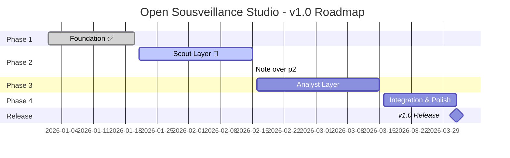

# 📅 Project Plan: Open Sousveillance Studio

**Version:** 1.0
**Last Updated:** 2026-01-29
**Project Lead:** Hans
**Target Release:** v1.0.0

---

## 🎯 Executive Summary

**Open Sousveillance Studio** is an AI-powered civic monitoring platform designed to automatically track government activities in Alachua County, Florida. The system focuses on environmental protection (specifically the Santa Fe River Basin and Floridan Aquifer) and democratic accountability.

### Vision Statement
>
> "Understanding systems is the path to freedom."

Build a 24/7 automated monitoring system that levels the information playing field between citizens and special interests by making government activity transparent and enabling effective advocacy.

### Success Criteria for v1.0

1. **Automated daily monitoring** of 5+ critical government sources
2. **Structured data extraction** from meeting agendas and PDFs
3. **Alert system** for high-priority items (RED/YELLOW/GREEN)
4. **Human-in-the-loop approval** for analyst reports
5. **REST API** for integration with other tools
6. **Deployable** on a single server with Docker

---

## 📆 Project Timeline

### Overview

---

## 🛤️ Phase Breakdown

### Phase 1: Foundation ✅ (Complete)

**Duration:** Jan 1-20, 2026
**Status:** Complete

| Deliverable | Status |
|:------------|:-------|
| Project structure and configuration | ✅ |
| Pydantic schemas for all data models | ✅ |
| Supabase database connection | ✅ |
| YAML configuration system | ✅ |
| Source registry documentation | ✅ |
| README and architecture docs | ✅ |
| Prompt library (A1-A4, B1-B2, C1-C4) | ✅ |

---

### Phase 2: Scout Layer 🚧 (Current)

**Duration:** Jan 21 - Feb 15, 2026
**Status:** In Progress

#### Goals

- Automated scraping of government portals (scheduled daily at 4am, plus manual trigger)
- PDF document processing
- Structured data extraction
- Change detection and deduplication

#### Deliverables

| Deliverable | Status | Target Date |
|:------------|:-------|:------------|
| Firecrawl client wrapper | ✅ | Jan 29 |
| Docling PDF processor | ✅ | Jan 29 |
| CivicClerk scraper (City of Alachua) | 🔲 | Feb 5 |
| eScribe scraper (Alachua County) | 🔲 | Feb 8 |
| Florida Public Notices scraper | 🔲 | Feb 10 |
| Document storage with Supabase | 🔲 | Feb 12 |
| Change detection (content hashing) | 🔲 | Feb 14 |
| Celery task scheduling | ✅ | Jan 29 |
| Scout agent integration tests | 🔲 | Feb 15 |

#### Key Milestones

- **Feb 5:** First automated scrape of CivicClerk
- **Feb 15:** All critical sources monitored daily

---

### Phase 3: Analyst Layer

**Duration:** Feb 16 - Mar 15, 2026
**Status:** Planned

#### Goals

- Deep research via Tavily integration
- Pattern recognition across Scout data
- Human-in-the-loop approval workflow
- LangGraph workflow orchestration

#### Deliverables

| Deliverable | Status | Target Date |
|:------------|:-------|:------------|
| LangGraph workflow implementation | 🔲 | Feb 22 |
| Tavily deep research integration | 🔲 | Feb 25 |
| Supabase checkpointer for state | 🔲 | Feb 28 |
| Human approval checkpoint (interrupt/resume) | 🔲 | Mar 5 |
| FastAPI approval endpoints | ✅ | Jan 29 |
| Email notifications (Resend) | 🔲 | Mar 10 |
| Analyst agent integration tests | 🔲 | Mar 15 |

#### Key Milestones

- **Feb 28:** First end-to-end Scout → Analyst workflow
- **Mar 15:** Human approval workflow functional

---

### Phase 4: Integration & Polish

**Duration:** Mar 16 - Apr 1, 2026
**Status:** Planned

#### Goals

- End-to-end system testing
- Docker deployment configuration
- Documentation completion
- Performance optimization

#### Deliverables

| Deliverable | Status | Target Date |
|:------------|:-------|:------------|
| Docker Compose configuration | 🔲 | Mar 18 |
| Environment setup documentation | 🔲 | Mar 20 |
| Integration test suite | 🔲 | Mar 25 |
| Performance benchmarking | 🔲 | Mar 28 |
| Security review | 🔲 | Mar 30 |
| v1.0 release preparation | 🔲 | Apr 1 |

#### Key Milestones

- **Mar 25:** All integration tests passing
- **Apr 1:** v1.0.0 release

---

## 🚀 Release Plan

### v1.0.0 (April 2026) - MVP

**Theme:** Automated Civic Monitoring

**Features:**
- Daily automated monitoring of critical government sources
- PDF agenda/packet processing
- Scout reports with urgency alerts
- Analyst deep research with human approval
- REST API for external integration
- Docker deployment

**Out of Scope for v1.0:**
- Public-facing dashboard
- Newsletter generation (Synthesizer layer)
- Multi-jurisdiction support
- Mobile app

---

### v1.1.0 (June 2026) - Synthesizer Layer

**Theme:** Public Communication

**Planned Features:**
- Newsletter generation with MJML
- Resend email integration
- Social media content templates
- Public dashboard (read-only)

---

### v2.0.0 (Q4 2026) - Multi-Jurisdiction

**Theme:** Scale & Expand

**Planned Features:**
- Multi-jurisdiction deployment
- White-label configuration
- Advanced analytics dashboard
- Community contribution system

---

## 🤖 Future Agents Roadmap

### Additional Scouts (Layer 1)

| Agent | Purpose | Data Source | Priority | Target Release |
|:------|:--------|:------------|:---------|:---------------|
| **A5: Budget Scout** | Track budget amendments, appropriations, fund transfers | City/County budget portals, CAFR documents | High | v1.1 |
| **A6: Property Scout** | Monitor property transfers, deed recordings, ownership changes | County Property Appraiser, Clerk of Court | High | v1.1 |
| **A7: Court Scout** | Track lawsuits involving government, developers, environmental groups | PACER, County Clerk, FL Court system | Medium | v1.2 |
| **A8: FOIA Scout** | Monitor public records requests and responses | Muckrock, local FOIA logs | Low | v2.0 |

**Rationale:**
- **Budget Scout** — Money follows intent. Budget changes often signal project approvals before public announcements.
- **Property Scout** — Developers acquire land quietly before filing permits. Early detection of land assembly patterns.
- **Court Scout** — Litigation reveals information not in public meetings. Settlement agreements can change project scope.
- **FOIA Scout** — What others are investigating often reveals emerging issues.

### Additional Analysts (Layer 2)

| Agent | Purpose | Input | Priority | Target Release |
|:------|:--------|:------|:---------|:---------------|
| **B3: Timeline Analyst** | Reconstruct chronological history of a project/issue | All Scout reports for an entity | High | v1.1 |
| **B4: Network Analyst** | Map relationships between developers, consultants, officials | Property records, meeting attendees, campaign finance | Medium | v1.2 |
| **B5: Compliance Analyst** | Check if procedures followed legal requirements | Scout reports + statutory requirements | High | v1.1 |

**Rationale:**
- **Timeline Analyst** — Helps citizens understand "how did we get here?" and identify procedural gaps.
- **Network Analyst** — Reveals conflicts of interest, revolving door patterns.
- **Compliance Analyst** — Flags when public notice periods weren't met, quorum issues, Sunshine Law violations.

### Additional Synthesizers (Layer 3)

| Agent | Purpose | Output | Priority | Target Release |
|:------|:--------|:-------|:---------|:---------------|
| **C5: Public Comment Generator** | Draft talking points for citizens attending meetings | Structured bullet points | High | v1.1 |
| **C6: FOIA Request Generator** | Draft public records requests based on gaps identified | Ready-to-submit FOIA letters | Medium | v1.2 |
| **C7: Explainer Generator** | Create "What does this mean?" content for complex issues | Plain-language summaries | High | v1.1 |

**Rationale:**
- **Public Comment Generator** — Directly increases civic participation by lowering the barrier.
- **FOIA Request Generator** — Automates the "what should I ask for?" problem.
- **Explainer Generator** — Translates government jargon for general public.

### Reactive Agents (New Layer)

| Agent | Purpose | Trigger | Priority | Target Release |
|:------|:--------|:--------|:---------|:---------------|
| **R1: Meeting Prep Agent** | Generate briefing packet before upcoming meetings | 48 hours before scheduled meeting | High | v1.1 |
| **R2: Deadline Tracker** | Alert when public comment periods are closing | X days before deadline | Critical | v1.0.1 |
| **R3: Anomaly Detector** | Flag unusual patterns (rushed approvals, missing documents) | Continuous | Medium | v1.2 |

**Rationale:**
- **Meeting Prep Agent** — Gives citizens time to prepare, not just react.
- **Deadline Tracker** — The most common failure mode: "I didn't know the deadline."
- **Anomaly Detector** — Catches things that don't match normal procedures.

---

## ✨ High-Value Features Roadmap

### Citizen Engagement Features

| Feature | Description | Value | Priority | Target |
|:--------|:------------|:------|:---------|:-------|
| **Deadline Dashboard** | Visual calendar of upcoming public comment deadlines | Solves #1 citizen complaint | Critical | v1.0.1 |
| **Subscribe to Entity** | Get alerts when specific project/org is mentioned | Personalized monitoring | High | v1.1 |
| **Meeting Reminder System** | SMS/email reminders before meetings with relevant agendas | Increases attendance | High | v1.1 |
| **"Explain This" Button** | One-click plain-language explanation of any item | Accessibility | Medium | v1.2 |
| **Civic Action Tracker** | Track what happened after citizens engaged | Feedback loop | Medium | v1.2 |

### Data Intelligence Features

| Feature | Description | Value | Priority | Target |
|:--------|:------------|:------|:---------|:-------|
| **Change Detection** | Only process new/modified content | Cost savings, efficiency | Critical | v1.0 |
| **Entity Resolution** | Link "Tara Forest LLC" ↔ "Tara Development" ↔ "PSE22-0002" | Better tracking | High | v1.1 |
| **Historical RAG** | Search past reports semantically | Institutional memory | High | v1.1 |
| **Trend Analysis** | "Permit applications up 40% this quarter" | Pattern detection | Medium | v1.2 |
| **Cross-Source Correlation** | Same item appears in meeting AND permit portal | Comprehensive view | Medium | v1.2 |

### Operational Features

| Feature | Description | Value | Priority | Target |
|:--------|:------------|:------|:---------|:-------|
| **Source Health Monitor** | Alert when scraping fails or format changes | Reliability | Critical | v1.0 |
| **Cost Dashboard** | Track API usage and costs in real-time | Budget control | High | v1.0.1 |
| **Audit Log** | Full traceability of all agent actions | Accountability | High | v1.0 |
| **Feedback Collection** | "Was this alert useful?" → improves prompts | Continuous improvement | Medium | v1.1 |
| **Multi-User Access** | Role-based access for coalition members | Team collaboration | Medium | v1.2 |

### Integration Features

| Feature | Description | Value | Priority | Target |
|:--------|:------------|:------|:---------|:-------|
| **Email Digest** | Daily/weekly summary emails | Primary distribution | High | v1.1 |
| **SMS Alerts** | Twilio integration for RED alerts | Immediate notification | High | v1.1 |
| **Slack/Discord Bot** | Post alerts to community channels | Community reach | Medium | v1.2 |
| **Calendar Integration** | Add meetings to Google/Outlook calendar | Convenience | Medium | v1.2 |
| **Public API** | Allow third-party apps to consume data | Ecosystem | Low | v2.0 |
| **Webhook System** | Push notifications to external systems | Automation | Low | v2.0 |

### Transparency Features

| Feature | Description | Value | Priority | Target |
|:--------|:------------|:------|:---------|:-------|
| **Source Attribution** | Every claim links to original document | Trust | Critical | v1.0 |
| **Confidence Scores** | Show AI certainty level on extractions | Transparency | High | v1.0 |
| **"Show Your Work"** | Expandable reasoning for each alert | Accountability | High | v1.1 |
| **Correction System** | Citizens can flag errors → human review | Accuracy | Medium | v1.2 |

### Community & Collaboration Features

| Feature | Description | Value | Priority | Target |
|:--------|:------------|:------|:---------|:-------|
| **Crowdsourced Watchlist** | Citizens suggest keywords/entities to monitor | Community-driven priorities | Medium | v1.2 |
| **Expert Network** | Connect citizens with lawyers, journalists, scientists | Amplify impact | Low | v2.0 |
| **Meeting Attendance Coordination** | "Who's going to Tuesday's meeting?" | Collective action | Medium | v1.2 |
| **Victory Tracking** | Document when citizen engagement changed outcomes | Motivation | Medium | v1.2 |

### Advanced Analytics Features

| Feature | Description | Value | Priority | Target |
|:--------|:------------|:------|:---------|:-------|
| **Developer Scorecard** | Track record of each developer (approvals, violations, lawsuits) | Accountability | High | v1.2 |
| **Official Voting History** | How did each commissioner vote on environmental issues? | Electoral accountability | High | v1.2 |
| **Permit Pipeline Visualization** | Map showing all active permits by location | Spatial awareness | Medium | v2.0 |
| **Impact Modeling** | "If approved, this adds X homes to the aquifer recharge zone" | Quantified risk | Low | v2.0 |

### Proactive Intelligence Features

| Feature | Description | Value | Priority | Target |
|:--------|:------------|:------|:---------|:-------|
| **Predictive Alerts** | "Based on patterns, this project likely to be approved" | Early warning | Medium | v2.0 |
| **Similar Case Finder** | "This is similar to Project X which was approved in 2023" | Precedent research | High | v1.2 |
| **Stakeholder Mapping** | Who has spoken at meetings? Who donated to campaigns? | Power analysis | Medium | v2.0 |
| **Document Gap Detection** | "Required environmental study not found in record" | Compliance checking | High | v1.1 |

### Accessibility & Reach Features

| Feature | Description | Value | Priority | Target |
|:--------|:------------|:------|:---------|:-------|
| **Spanish Translation** | Auto-translate alerts for Spanish-speaking community | Inclusivity | High | v1.2 |
| **Audio Summaries** | Text-to-speech for visually impaired or busy citizens | Accessibility | Medium | v2.0 |
| **Low-Bandwidth Mode** | SMS-only option for rural areas | Reach | Medium | v1.2 |
| **Print-Ready Reports** | PDF formatted for community bulletin boards | Offline distribution | Low | v1.2 |

---

## 📝 Epics, Features & User Stories

### Epic 1: Automated Data Collection (E1)

**Goal:** Automatically monitor government data sources and extract structured information.

#### Feature 1.1: Web Scraping Infrastructure

| User Story | Acceptance Criteria | Tasks | Estimate |
|:-----------|:--------------------|:------|:---------|
| As a system operator, I want to scrape government portals automatically so that I don't have to manually check for updates | Firecrawl successfully scrapes CivicClerk, eScribe, and static sites | T1.1.1: Implement Firecrawl client wrapper T1.1.2: Add retry logic with exponential backoff T1.1.3: Implement rate limiting T1.1.4: Add scraping health checks | 8 hrs |
| As a system operator, I want to handle JavaScript-heavy SPAs so that React/Angular portals are scraped correctly | CivicClerk portal returns complete content including dynamically loaded items | T1.1.5: Configure Firecrawl actions (wait, scroll, click) T1.1.6: Test against CivicClerk portal T1.1.7: Document scraping patterns | 6 hrs |

#### Feature 1.2: PDF Processing

| User Story | Acceptance Criteria | Tasks | Estimate |
|:-----------|:--------------------|:------|:---------|
| As a system operator, I want to extract text from PDF agendas so that meeting content is searchable | PDF text extracted with >95% accuracy, tables preserved | T1.2.1: Implement Docling processor T1.2.2: Add table extraction T1.2.3: Implement chunking pipeline T1.2.4: Test with sample agendas | 6 hrs |
| As a system operator, I want to handle scanned PDFs so that older documents are still processed | OCR extracts text from image-based PDFs | T1.2.5: Enable Docling OCR T1.2.6: Test with scanned documents | 4 hrs |

#### Feature 1.3: Change Detection

| User Story | Acceptance Criteria | Tasks | Estimate |
|:-----------|:--------------------|:------|:---------|
| As a system operator, I want to skip unchanged content so that I don't waste API credits | Content hash comparison prevents reprocessing | T1.3.1: Implement content hashing T1.3.2: Store hashes in Supabase T1.3.3: Add hash comparison before processing | 4 hrs |
| As a system operator, I want to detect partial changes so that only new agenda items are processed | Diff detection identifies new items in updated documents | T1.3.4: Implement document diffing T1.3.5: Track item-level changes | 6 hrs |

---

### Epic 2: Intelligent Analysis (E2)

**Goal:** Extract actionable intelligence from raw data using AI.

#### Feature 2.1: Scout Agents

| User Story | Acceptance Criteria | Tasks | Estimate |
|:-----------|:--------------------|:------|:---------|
| As a citizen, I want meeting agendas analyzed automatically so that I know what's important | ScoutReport generated with executive summary and alerts | T2.1.1: Implement ScoutAgent class T2.1.2: Create Scout prompts T2.1.3: Integrate with Gemini T2.1.4: Add keyword matching | 8 hrs |
| As a citizen, I want urgency levels assigned so that I know what needs immediate attention | RED/YELLOW/GREEN alerts based on deadlines and keywords | T2.1.5: Implement UrgencyAlert schema T2.1.6: Add deadline extraction T2.1.7: Configure urgency rules | 4 hrs |

#### Feature 2.2: Analyst Agents

| User Story | Acceptance Criteria | Tasks | Estimate |
|:-----------|:--------------------|:------|:---------|
| As a citizen, I want deep research on flagged items so that I understand the full context | AnalystReport with sections, sources, and recommendations | T2.2.1: Implement AnalystAgent class T2.2.2: Integrate Tavily search T2.2.3: Create Analyst prompts T2.2.4: Add source citation | 10 hrs |
| As a citizen, I want pattern recognition across reports so that I see connections I'd miss | Cross-report analysis identifies related items | T2.2.5: Implement RAG over past reports T2.2.6: Add entity linking T2.2.7: Create pattern detection prompts | 8 hrs |

#### Feature 2.3: Reactive Agents

| User Story | Acceptance Criteria | Tasks | Estimate |
|:-----------|:--------------------|:------|:---------|
| As a citizen, I want deadline alerts so that I never miss a public comment period | Alerts sent X days before deadline | T2.3.1: Implement DeadlineTracker agent T2.3.2: Extract deadlines from reports T2.3.3: Configure alert thresholds | 6 hrs |
| As a citizen, I want meeting prep packets so that I can prepare before attending | Briefing generated 48 hours before meeting | T2.3.4: Implement MeetingPrep agent T2.3.5: Aggregate relevant reports T2.3.6: Generate talking points | 8 hrs |

---

### Epic 3: Human-in-the-Loop (E3)

**Goal:** Ensure human oversight before public distribution.

#### Feature 3.1: Approval Workflow

| User Story | Acceptance Criteria | Tasks | Estimate |
|:-----------|:--------------------|:------|:---------|
| As a coalition leader, I want to review reports before publishing so that we maintain accuracy | LangGraph interrupt pauses workflow for approval | T3.1.1: Implement LangGraph interrupt T3.1.2: Create approval state machine T3.1.3: Add timeout handling | 6 hrs |
| As a coalition leader, I want to approve/reject via UI so that I don't need technical skills | Streamlit approval interface with approve/reject/edit | T3.1.4: Build approval UI T3.1.5: Add edit capability T3.1.6: Implement rejection feedback | 8 hrs |

#### Feature 3.2: Notification System

| User Story | Acceptance Criteria | Tasks | Estimate |
|:-----------|:--------------------|:------|:---------|
| As a coalition leader, I want email notifications for pending approvals so that I don't miss them | Email sent when approval needed, reminder after 24 hours | T3.2.1: Integrate Resend API T3.2.2: Create email templates T3.2.3: Add reminder logic | 4 hrs |
| As a coalition leader, I want approval status dashboard so that I see what's pending | Dashboard shows pending, approved, rejected items | T3.2.4: Build status dashboard T3.2.5: Add filtering and search | 4 hrs |

---

### Epic 4: Citizen Distribution (E4)

**Goal:** Deliver actionable intelligence to citizens through multiple channels.

#### Feature 4.1: Email Distribution

| User Story | Acceptance Criteria | Tasks | Estimate |
|:-----------|:--------------------|:------|:---------|
| As a citizen, I want weekly email digests so that I stay informed without checking daily | Weekly email with summary and links | T4.1.1: Create email templates (MJML) T4.1.2: Implement digest generation T4.1.3: Add subscription management | 8 hrs |
| As a citizen, I want immediate alerts for RED items so that I can act quickly | SMS/email within 1 hour of RED alert | T4.1.4: Integrate Twilio for SMS T4.1.5: Implement alert routing T4.1.6: Add opt-in/opt-out | 6 hrs |

#### Feature 4.2: Public Dashboard

| User Story | Acceptance Criteria | Tasks | Estimate |
|:-----------|:--------------------|:------|:---------|
| As a citizen, I want a public dashboard so that I can browse reports anytime | Read-only dashboard with search and filters | T4.2.1: Design dashboard UI T4.2.2: Implement report listing T4.2.3: Add search functionality T4.2.4: Add deadline calendar view | 12 hrs |
| As a citizen, I want to subscribe to specific entities so that I only get relevant alerts | Entity subscription with notification preferences | T4.2.5: Implement subscription system T4.2.6: Add notification preferences T4.2.7: Build subscription UI | 8 hrs |

#### Feature 4.3: Civic Action Tools

| User Story | Acceptance Criteria | Tasks | Estimate |
|:-----------|:--------------------|:------|:---------|
| As a citizen, I want talking points for meetings so that I can speak effectively | Generated bullet points based on report | T4.3.1: Implement PublicComment agent T4.3.2: Create talking point templates T4.3.3: Add customization options | 6 hrs |
| As a citizen, I want FOIA request templates so that I can request records easily | Pre-filled FOIA request based on identified gaps | T4.3.4: Implement FOIAGenerator agent T4.3.5: Create request templates T4.3.6: Add agency routing | 6 hrs |

---

### Epic 5: System Operations (E5)

**Goal:** Ensure reliable, cost-effective, and transparent system operation.

#### Feature 5.1: Monitoring & Alerting

| User Story | Acceptance Criteria | Tasks | Estimate |
|:-----------|:--------------------|:------|:---------|
| As a system operator, I want scraping failure alerts so that I know when sources break | Alert within 15 minutes of scraping failure | T5.1.1: Implement health checks T5.1.2: Add failure alerting T5.1.3: Create status dashboard | 4 hrs |
| As a system operator, I want cost tracking so that I stay within budget | Real-time API cost dashboard | T5.1.4: Track API calls T5.1.5: Calculate costs T5.1.6: Add budget alerts | 4 hrs |

#### Feature 5.2: Audit & Compliance

| User Story | Acceptance Criteria | Tasks | Estimate |
|:-----------|:--------------------|:------|:---------|
| As a system operator, I want full audit logs so that all actions are traceable | Every agent action logged with timestamp and context | T5.2.1: Implement audit logging T5.2.2: Add log retention policy T5.2.3: Create audit report generator | 4 hrs |
| As a citizen, I want source attribution so that I can verify claims | Every claim links to original document | T5.2.4: Implement source linking T5.2.5: Add citation format T5.2.6: Create "view source" UI | 4 hrs |

#### Feature 5.3: Feedback Loop

| User Story | Acceptance Criteria | Tasks | Estimate |
|:-----------|:--------------------|:------|:---------|
| As a citizen, I want to report errors so that the system improves | "Flag as incorrect" button with feedback form | T5.3.1: Add feedback UI T5.3.2: Route to human review T5.3.3: Track correction rate | 4 hrs |
| As a system operator, I want feedback analytics so that I can improve prompts | Dashboard showing feedback trends | T5.3.4: Aggregate feedback data T5.3.5: Identify problem areas T5.3.6: A/B test prompt improvements | 6 hrs |

---

### Epic 6: Multi-Jurisdiction Scale (E6)

**Goal:** Enable deployment for any US municipality.

#### Feature 6.1: Configuration-Driven Deployment

| User Story | Acceptance Criteria | Tasks | Estimate |
|:-----------|:--------------------|:------|:---------|
| As a new community, I want to deploy with zero code changes so that I can start quickly | Fork, configure YAML, deploy | T6.1.1: Document deployment process T6.1.2: Create configuration wizard T6.1.3: Add validation for configs | 6 hrs |
| As a new community, I want example configurations so that I have a starting point | Example configs for 5+ jurisdictions | T6.1.4: Create example configs T6.1.5: Document common platforms T6.1.6: Build config generator | 8 hrs |

#### Feature 6.2: Shared Learning

| User Story | Acceptance Criteria | Tasks | Estimate |
|:-----------|:--------------------|:------|:---------|
| As a community, I want to share effective prompts so that others benefit | Opt-in prompt sharing with anonymization | T6.2.1: Design sharing protocol T6.2.2: Implement opt-in sharing T6.2.3: Create prompt library | 8 hrs |
| As a community, I want to share scraping patterns so that new sources are easier | Shared scraper configurations | T6.2.4: Create scraper pattern library T6.2.5: Add contribution workflow | 6 hrs |

---

## Resource Requirements

### Infrastructure

| Resource | Specification | Monthly Cost |
|:---------|:--------------|:-------------|
| Server | 2 vCPU, 4GB RAM | ~$20 |
| Redis | Managed or self-hosted | ~$0-15 |
| Supabase | Free tier sufficient for MVP | $0 |
| Domain + SSL | Standard | ~$15/year |

### API Costs (Estimated)

| Service | Usage | Monthly Cost |
|:--------|:------|:-------------|
| Firecrawl | ~1,500 scrapes | $16 (Hobby) |
| Google AI (Gemini) | ~50K tokens/day | ~$10-20 |
| Tavily | ~500 searches | Free tier |
| **Total** | | **~$50/month** |

### Team

- **Project Lead:** Hans (part-time)
- **AI Assistant:** Cascade (development support)

---

## Risk Assessment

| Risk | Likelihood | Impact | Mitigation |
|:-----|:-----------|:-------|:-----------|
| CivicClerk blocks scraping | Medium | High | Use Firecrawl stealth mode, respect rate limits |
| Gemini API changes | Low | Medium | Abstract LLM layer, support multiple providers |
| Supabase free tier limits | Low | Low | Monitor usage, upgrade if needed |
| Scope creep | High | Medium | Strict MVP definition, defer to v1.1+ |
| Single developer bandwidth | High | High | Prioritize ruthlessly, automate testing |

---

## Success Metrics

### v1.0 Release Criteria

- [ ] 5+ government sources monitored daily
- [ ] <5% scraping failure rate
- [ ] Scout reports generated within 30 minutes of source update
- [ ] Human approval workflow functional
- [ ] API response time <2 seconds
- [ ] Zero critical security vulnerabilities

### Post-Release KPIs

- Number of alerts generated per week
- Time from government action to citizen notification
- User engagement with reports
- System uptime (target: 99%)

---

## 📣 Communication Plan

### Stakeholders

- **Our Alachua Water Coalition** - Primary user/sponsor
- **Community members** - End users
- **Technical contributors** - Future open-source contributors

### Updates

- Weekly progress updates to stakeholders
- GitHub releases for each milestone
- Documentation updates with each phase

---

## 📎 Appendix

### Related Documents

- `SPEC.md` - Technical specification
- `PROJECT_MANAGEMENT.md` - Detailed task tracking
- `TODO.md` - Development task list
- `README.md` - Project overview and setup

### Change Log

| Date | Version | Changes |
|:-----|:--------|:--------|
| 2026-01-29 | 1.0 | Initial project plan created |
| 2026-01-30 | 1.1 | Added future agents roadmap, high-value features roadmap |
| 2026-01-30 | 1.2 | Added community, analytics, proactive, accessibility features; Added Epics, Features, User Stories, Tasks |
