# Project Plan: Open Sousveillance Studio

**Version:** 1.0  
**Last Updated:** 2026-01-29  
**Project Lead:** Hans  
**Target Release:** v1.0.0

---

## Executive Summary

**Open Sousveillance Studio** is an AI-powered civic monitoring platform designed to automatically track government activities in Alachua County, Florida. The system focuses on environmental protection (specifically the Santa Fe River Basin and Floridan Aquifer) and democratic accountability.

### Vision Statement
>
> "Understanding systems is the path to freedom."

Build a 24/7 automated monitoring system that levels the information playing field between citizens and special interests by making government activity transparent and enabling effective advocacy.

### Success Criteria for v1.0

1. **Automated daily monitoring** of 5+ critical government sources
2. **Structured data extraction** from meeting agendas and PDFs
3. **Alert system** for high-priority items (RED/YELLOW/GREEN)
4. **Human-in-the-loop approval** for analyst reports
5. **REST API** for integration with other tools
6. **Deployable** on a single server with Docker

---

## Project Timeline

### Overview

```mermaid
gantt
    title Open Sousveillance Studio - v1.0 Roadmap
    dateFormat  YYYY-MM-DD
    
    section Phase 1
    Foundation ✅           :done, p1, 2026-01-01, 2026-01-20
    
    section Phase 2
    Scout Layer 🚧          :active, p2, 2026-01-21, 2026-02-15
    
    section Phase 3
    Analyst Layer           :p3, 2026-02-16, 2026-03-15
    
    section Phase 4
    Integration & Polish    :p4, 2026-03-16, 2026-04-01
    
    section Release
    v1.0 Release 🚀         :milestone, 2026-04-01, 0d
```

---

## Phase Breakdown

### Phase 1: Foundation ✅ (Complete)

**Duration:** Jan 1-20, 2026  
**Status:** Complete

| Deliverable | Status |
|:------------|:-------|
| Project structure and configuration | ✅ |
| Pydantic schemas for all data models | ✅ |
| Supabase database connection | ✅ |
| YAML configuration system | ✅ |
| Source registry documentation | ✅ |
| README and architecture docs | ✅ |
| Prompt library (A1-A4, B1-B2, C1-C4) | ✅ |

---

### Phase 2: Scout Layer 🚧 (Current)

**Duration:** Jan 21 - Feb 15, 2026  
**Status:** In Progress

#### Goals

- Automated scraping of government portals
- PDF document processing
- Structured data extraction
- Change detection and deduplication

#### Deliverables

| Deliverable | Status | Target Date |
|:------------|:-------|:------------|
| Firecrawl client wrapper | ✅ | Jan 29 |
| Docling PDF processor | ✅ | Jan 29 |
| CivicClerk scraper (City of Alachua) | 🔲 | Feb 5 |
| eScribe scraper (Alachua County) | 🔲 | Feb 8 |
| Florida Public Notices scraper | 🔲 | Feb 10 |
| Document storage with Supabase | 🔲 | Feb 12 |
| Change detection (content hashing) | 🔲 | Feb 14 |
| Celery task scheduling | ✅ | Jan 29 |
| Scout agent integration tests | 🔲 | Feb 15 |

#### Key Milestones

- **Feb 5:** First automated scrape of CivicClerk
- **Feb 15:** All critical sources monitored daily

---

### Phase 3: Analyst Layer

**Duration:** Feb 16 - Mar 15, 2026  
**Status:** Planned

#### Goals

- Deep research via Tavily integration
- Pattern recognition across Scout data
- Human-in-the-loop approval workflow
- LangGraph workflow orchestration

#### Deliverables

| Deliverable | Status | Target Date |
|:------------|:-------|:------------|
| LangGraph workflow implementation | 🔲 | Feb 22 |
| Tavily deep research integration | 🔲 | Feb 25 |
| Supabase checkpointer for state | 🔲 | Feb 28 |
| Human approval checkpoint (interrupt/resume) | 🔲 | Mar 5 |
| FastAPI approval endpoints | ✅ | Jan 29 |
| Email notifications (Resend) | 🔲 | Mar 10 |
| Analyst agent integration tests | 🔲 | Mar 15 |

#### Key Milestones

- **Feb 28:** First end-to-end Scout → Analyst workflow
- **Mar 15:** Human approval workflow functional

---

### Phase 4: Integration & Polish

**Duration:** Mar 16 - Apr 1, 2026  
**Status:** Planned

#### Goals

- End-to-end system testing
- Docker deployment configuration
- Documentation completion
- Performance optimization

#### Deliverables

| Deliverable | Status | Target Date |
|:------------|:-------|:------------|
| Docker Compose configuration | 🔲 | Mar 18 |
| Environment setup documentation | 🔲 | Mar 20 |
| Integration test suite | 🔲 | Mar 25 |
| Performance benchmarking | 🔲 | Mar 28 |
| Security review | 🔲 | Mar 30 |
| v1.0 release preparation | 🔲 | Apr 1 |

#### Key Milestones

- **Mar 25:** All integration tests passing
- **Apr 1:** v1.0.0 release

---

## Release Plan

### v1.0.0 (April 2026) - MVP

**Theme:** Automated Civic Monitoring

**Features:**
- Daily automated monitoring of critical government sources
- PDF agenda/packet processing
- Scout reports with urgency alerts
- Analyst deep research with human approval
- REST API for external integration
- Docker deployment

**Out of Scope for v1.0:**
- Public-facing dashboard
- Newsletter generation (Synthesizer layer)
- Multi-jurisdiction support
- Mobile app

---

### v1.1.0 (June 2026) - Synthesizer Layer

**Theme:** Public Communication

**Planned Features:**
- Newsletter generation with MJML
- Resend email integration
- Social media content templates
- Public dashboard (read-only)

---

### v2.0.0 (Q4 2026) - Multi-Jurisdiction

**Theme:** Scale & Expand

**Planned Features:**
- Multi-jurisdiction deployment
- White-label configuration
- Advanced analytics dashboard
- Community contribution system

---

## Resource Requirements

### Infrastructure

| Resource | Specification | Monthly Cost |
|:---------|:--------------|:-------------|
| Server | 2 vCPU, 4GB RAM | ~$20 |
| Redis | Managed or self-hosted | ~$0-15 |
| Supabase | Free tier sufficient for MVP | $0 |
| Domain + SSL | Standard | ~$15/year |

### API Costs (Estimated)

| Service | Usage | Monthly Cost |
|:--------|:------|:-------------|
| Firecrawl | ~1,500 scrapes | $16 (Hobby) |
| Google AI (Gemini) | ~50K tokens/day | ~$10-20 |
| Tavily | ~500 searches | Free tier |
| **Total** | | **~$50/month** |

### Team

- **Project Lead:** Hans (part-time)
- **AI Assistant:** Cascade (development support)

---

## Risk Assessment

| Risk | Likelihood | Impact | Mitigation |
|:-----|:-----------|:-------|:-----------|
| CivicClerk blocks scraping | Medium | High | Use Firecrawl stealth mode, respect rate limits |
| Gemini API changes | Low | Medium | Abstract LLM layer, support multiple providers |
| Supabase free tier limits | Low | Low | Monitor usage, upgrade if needed |
| Scope creep | High | Medium | Strict MVP definition, defer to v1.1+ |
| Single developer bandwidth | High | High | Prioritize ruthlessly, automate testing |

---

## Success Metrics

### v1.0 Release Criteria

- [ ] 5+ government sources monitored daily
- [ ] <5% scraping failure rate
- [ ] Scout reports generated within 30 minutes of source update
- [ ] Human approval workflow functional
- [ ] API response time <2 seconds
- [ ] Zero critical security vulnerabilities

### Post-Release KPIs

- Number of alerts generated per week
- Time from government action to citizen notification
- User engagement with reports
- System uptime (target: 99%)

---

## Communication Plan

### Stakeholders

- **Our Alachua Water Coalition** - Primary user/sponsor
- **Community members** - End users
- **Technical contributors** - Future open-source contributors

### Updates

- Weekly progress updates to stakeholders
- GitHub releases for each milestone
- Documentation updates with each phase

---

## Appendix

### Related Documents

- `SPEC.md` - Technical specification
- `PROJECT_MANAGEMENT.md` - Detailed task tracking
- `TODO.md` - Development task list
- `README.md` - Project overview and setup

### Change Log

| Date | Version | Changes |
|:-----|:--------|:--------|
| 2026-01-29 | 1.0 | Initial project plan created |
