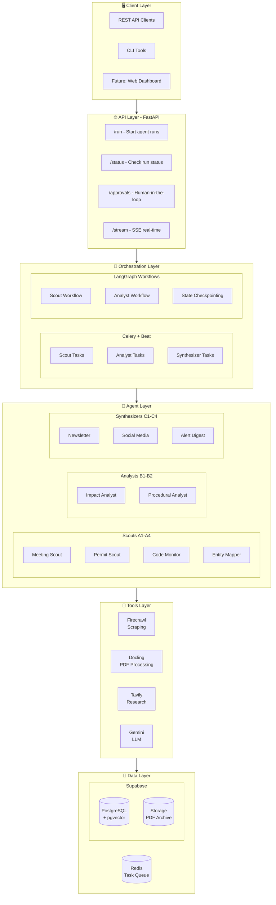
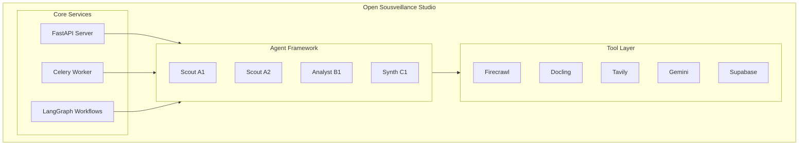
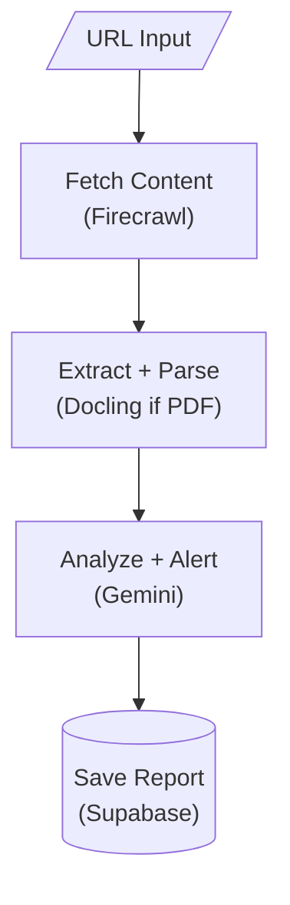
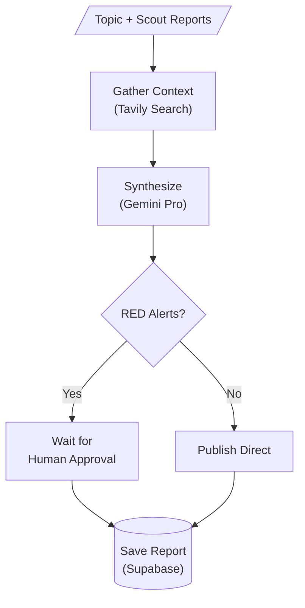

# Technical Specification: Open Sousveillance Studio

**Version:** 1.0  
**Last Updated:** 2026-01-29  
**Status:** Draft

---

## 1. Overview

### 1.1 Purpose
This document defines the technical specification for **Open Sousveillance Studio**, an AI-powered platform for automated monitoring of government activities in Alachua County, Florida.

### 1.2 Scope
This specification covers:
- System architecture
- Data models and schemas
- API specifications
- Integration requirements
- Security considerations
- Performance requirements

### 1.3 Definitions

| Term | Definition |
|:-----|:-----------|
| **Scout** | Layer 1 agent that monitors data sources and extracts information |
| **Analyst** | Layer 2 agent that synthesizes patterns and performs deep research |
| **Synthesizer** | Layer 3 agent that generates public-facing content |
| **Alert** | A flagged item requiring attention (RED/YELLOW/GREEN urgency) |
| **Source** | A government data source (website, portal, document repository) |

---

## 2. System Architecture

### 2.1 High-Level Architecture



### 2.2 Component Diagram



---

## 3. Technology Stack

### 3.1 Core Technologies

| Component | Technology | Version | Purpose |
|:----------|:-----------|:--------|:--------|
| **Runtime** | Python | 3.10+ | Primary language |
| **Web Framework** | FastAPI | 0.100+ | REST API server |
| **ASGI Server** | Uvicorn | 0.23+ | Production server |
| **Task Queue** | Celery | 5.3+ | Distributed task execution |
| **Message Broker** | Redis | 7.0+ | Celery broker/backend |
| **Orchestration** | LangGraph | 0.1+ | Multi-agent workflows |
| **LLM Framework** | LangChain | 0.1+ | LLM integration |

### 3.2 AI/ML Services

| Service | Provider | Purpose |
|:--------|:---------|:--------|
| **LLM** | Google Gemini 2.5 Pro | Complex reasoning, analysis |
| **LLM (Fast)** | Google Gemini 2.5 Flash | Extraction, simple tasks |
| **Search** | Tavily | AI-optimized web research |
| **Embeddings** | Google Gemini | Vector embeddings for RAG |

### 3.3 Data Services

| Service | Provider | Purpose |
|:--------|:---------|:--------|
| **Database** | Supabase PostgreSQL | Structured data storage |
| **Vector Store** | Supabase pgvector | Embedding storage, similarity search |
| **File Storage** | Supabase Storage | PDF archive, documents |

### 3.4 External Integrations

| Service | Provider | Purpose |
|:--------|:---------|:--------|
| **Web Scraping** | Firecrawl | JS rendering, PDF extraction |
| **Document Parsing** | Docling | PDF/DOCX parsing, table extraction |
| **Email** | Resend | Notification delivery (future) |

---

## 4. Data Models

### 4.1 Core Schemas

#### UrgencyLevel (Enum)

```python
class UrgencyLevel(str, Enum):
    RED = "RED"       # Immediate action required
    YELLOW = "YELLOW" # Monitor closely
    GREEN = "GREEN"   # Informational
```

#### UrgencyAlert

```python
class UrgencyAlert(BaseModel):
    level: UrgencyLevel
    deadline: Optional[date]
    action_item: str
    context: str
```

#### MeetingItem

```python
class MeetingItem(BaseModel):
    agenda_id: Optional[str]
    topic: str
    related_to: List[str]
    outcome: Optional[str]
```

#### ScoutReport

```python
class ScoutReport(BaseModel):
    report_id: str
    date_generated: datetime
    period_covered: str
    executive_summary: str
    alerts: List[UrgencyAlert]
    items: List[MeetingItem]
    raw_markdown: Optional[str]
```

### 4.2 Configuration Schemas

#### SourceConfig

```python
class SourceConfig(BaseModel):
    id: str
    name: str
    description: Optional[str]
    jurisdiction: str
    url: str
    platform: str
    priority: str  # critical, high, medium, low
    check_frequency: str  # daily, weekly, monthly
    scraping: ScrapingConfig
    document_types: List[str]
    boards: List[BoardConfig]
```

#### ProjectEntity

```python
class ProjectEntity(BaseModel):
    id: str
    name: str
    description: Optional[str]
    urgency: str
    status: str
    aliases: List[str]
    keywords: List[str]
    related_organizations: List[str]
    related_people: List[str]
    related_locations: List[str]
```

### 4.3 Database Schema

#### reports table

```sql
CREATE TABLE reports (
    id UUID PRIMARY KEY,
    type VARCHAR(50) NOT NULL,  -- 'scout', 'analyst', 'synthesizer'
    agent_id VARCHAR(10),
    created_at TIMESTAMP WITH TIME ZONE DEFAULT NOW(),
    data JSONB NOT NULL,
    embedding VECTOR(768)  -- For semantic search
);

CREATE INDEX idx_reports_type ON reports(type);
CREATE INDEX idx_reports_created ON reports(created_at DESC);
```

#### alerts table

```sql
CREATE TABLE alerts (
    id UUID PRIMARY KEY,
    report_id UUID REFERENCES reports(id),
    level VARCHAR(10) NOT NULL,  -- 'RED', 'YELLOW', 'GREEN'
    deadline DATE,
    action_item TEXT NOT NULL,
    context TEXT,
    acknowledged BOOLEAN DEFAULT FALSE,
    created_at TIMESTAMP WITH TIME ZONE DEFAULT NOW()
);

CREATE INDEX idx_alerts_level ON alerts(level);
CREATE INDEX idx_alerts_deadline ON alerts(deadline);
```

---

## 5. API Specification

### 5.1 Base URL

```
http://localhost:8000
```

### 5.2 Endpoints

#### Health Check

```
GET /health
Response: { "status": "healthy" }
```

#### Instance Info

```
GET /info
Response: {
    "instance": { "id": "alachua-fl", "name": "...", "timezone": "..." },
    "jurisdiction": { "state": "FL", "county": "Alachua" }
}
```

#### Start Agent Run

```
POST /run
Request: {
    "agent": "A1",
    "url": "https://...",
    "topic": "optional for analysts",
    "save": true
}
Response: {
    "run_id": "uuid",
    "agent": "A1",
    "status": "pending",
    "message": "Agent A1 run started"
}
```

#### Check Run Status

```
GET /status/{run_id}
Response: {
    "run_id": "uuid",
    "agent": "A1",
    "status": "completed",  // pending, running, completed, failed
    "started_at": "2026-01-29T18:00:00Z",
    "completed_at": "2026-01-29T18:05:00Z",
    "result": { ... },
    "error": null
}
```

#### List Pending Approvals

```
GET /approvals/pending
Response: {
    "count": 2,
    "pending": [
        {
            "id": "uuid",
            "agent": "B1",
            "created_at": "...",
            "summary": "...",
            "data": { ... }
        }
    ]
}
```

#### Approve/Reject

```
POST /approvals/{id}/decide
Request: {
    "decision": "approved",  // or "rejected"
    "comments": "optional"
}
Response: {
    "approval_id": "uuid",
    "decision": "approved",
    "comments": "...",
    "item_summary": "..."
}
```

#### SSE Stream

```
GET /stream/{run_id}
Response: Server-Sent Events stream
event: status
data: {"run_id": "...", "status": "running", ...}
```

---

## 6. Agent Specifications

### 6.1 Scout Agents (Layer 1)

| Agent | ID | Purpose | Frequency | Sources |
|:------|:---|:--------|:----------|:--------|
| Meeting Intelligence | A1 | Monitor meeting agendas/minutes | Daily | CivicClerk, eScribe |
| Permit Application | A2 | Track permit applications | Daily | SRWMD, FDEP |
| Legislative Code | A3 | Monitor code changes | Weekly | Municipal codes |
| Entity Relationship | A4 | Map connections | Weekly | Multiple |

#### Scout Workflow



### 6.2 Analyst Agents (Layer 2)

| Agent | ID | Purpose | Frequency | Requires Approval |
|:------|:---|:--------|:----------|:------------------|
| Impact Assessment | B1 | Analyze environmental/civic impact | Weekly | Yes |
| Procedural Integrity | B2 | Check process compliance | Weekly | Yes |

#### Analyst Workflow



---

## 7. Configuration

### 7.1 Environment Variables

```bash
# Required
GOOGLE_API_KEY=your_gemini_api_key

# Optional (with defaults)
FIRECRAWL_API_KEY=your_firecrawl_key
TAVILY_API_KEY=your_tavily_key
SUPABASE_URL=https://your-project.supabase.co
SUPABASE_KEY=your_supabase_anon_key

# Celery
CELERY_BROKER_URL=redis://localhost:6379/0
CELERY_RESULT_BACKEND=redis://localhost:6379/0
```

### 7.2 YAML Configuration Files

| File | Purpose |
|:-----|:--------|
| `config/instance.yaml` | Instance identity, jurisdiction, scheduling |
| `config/sources.yaml` | Government data sources to monitor |
| `config/entities.yaml` | Watchlist: projects, organizations, keywords |

---

## 8. Security Considerations

### 8.1 API Security
- CORS configuration for production
- Rate limiting on endpoints
- Input validation via Pydantic

### 8.2 Data Security
- API keys stored in environment variables
- Supabase Row Level Security (RLS)
- No PII stored without consent

### 8.3 Scraping Ethics
- Respect robots.txt
- Rate limiting (max 1 request/second)
- User-Agent identification
- Cache responses to minimize requests

---

## 9. Performance Requirements

### 9.1 Response Times
| Operation | Target | Maximum |
|:----------|:-------|:--------|
| API health check | <100ms | 500ms |
| Start agent run | <500ms | 2s |
| Scout report generation | <5min | 15min |
| Analyst report generation | <10min | 30min |

### 9.2 Throughput
| Metric | Target |
|:-------|:-------|
| Concurrent API requests | 50 |
| Daily scout runs | 100+ |
| Weekly analyst runs | 10+ |

### 9.3 Availability
| Metric | Target |
|:-------|:-------|
| Uptime | 99% |
| Scheduled task success rate | 95% |

---

## 10. Deployment

### 10.1 Development

```bash
# Start Redis
redis-server

# Start Celery worker
celery -A src.tasks.celery_app worker --loglevel=info

# Start Celery Beat
celery -A src.tasks.celery_app beat --loglevel=info

# Start FastAPI
uvicorn src.app:app --reload --port 8000
```

### 10.2 Production (Docker)

```yaml
# docker-compose.yml
services:
  redis:
    image: redis:7-alpine
    
  worker:
    build: .
    command: celery -A src.tasks.celery_app worker
    
  beat:
    build: .
    command: celery -A src.tasks.celery_app beat
    
  api:
    build: .
    command: uvicorn src.app:app --host 0.0.0.0
    ports:
      - "8000:8000"
```

---

## 11. Future Considerations

### 11.1 Scalability
- Horizontal scaling of Celery workers
- Read replicas for database
- CDN for static assets

### 11.2 Multi-Tenancy
- Jurisdiction-based data isolation
- Configurable source registries
- White-label deployment

### 11.3 Advanced Features
- Real-time WebSocket updates
- Mobile push notifications
- Public API for third-party integrations

---

## Appendix A: Glossary

| Term | Definition |
|:-----|:-----------|
| **Sousveillance** | Inverse surveillance; citizens monitoring authorities |
| **Karst** | Porous limestone terrain with sinkholes and springs |
| **CivicClerk** | Meeting management platform used by City of Alachua |
| **eScribe** | Meeting management platform used by Alachua County |
| **SRWMD** | Suwannee River Water Management District |

---

## Appendix B: References

- [Firecrawl Documentation](https://docs.firecrawl.dev)
- [Docling GitHub](https://github.com/docling-project/docling)
- [LangGraph Documentation](https://langchain-ai.github.io/langgraph/)
- [Supabase Documentation](https://supabase.com/docs)
- [Celery Documentation](https://docs.celeryq.dev)
