# 🔄 System Overview & Design Discussion

**Open Sousveillance Studio — Architecture Deep Dive**

*Document for brainstorming and refinement*

---

## 🎯 Core Concept

**Goal:** Automatically monitor local government activity and alert citizens before important decisions are made, not after.

**The Gap It Fills:** Government information is public but not accessible. Meeting agendas are posted 3-5 days before votes. Permit applications are buried in portals. By the time citizens find out, public comment periods have closed.

---

## 🏗️ Three-Layer Agent Architecture


---

## 🔍 Layer 1: Scouts — Data Collection

### Purpose

Fetch raw data from government sources, extract structured information, flag items matching the watchlist.

### Current Implementation

- `ScoutAgent` in `src/agents/scout.py`
- Uses Firecrawl to scrape web pages
- Gemini 2.5 Pro extracts structured `ScoutReport`
- Matches against keywords from `config/entities.yaml`

### Data Flow

```
URL → Firecrawl (scrape) → Raw Markdown → Gemini (analyze) → ScoutReport → Supabase
```

### ScoutReport Schema

```python
class ScoutReport(BaseReport):
    report_id: str           # "A1-2026-01-30"
    executive_summary: str   # Key findings
    alerts: List[UrgencyAlert]  # RED/YELLOW/GREEN items
    items: List[MeetingItem]    # Extracted agenda items
```

### Open Questions

1. Scouts run on a fixed daily schedule (4 AM), with support for manual triggering via API or Dev Console.
2. Do you want Scouts to store the raw scraped content, or just the extracted report?
3. Should each source have its own Scout instance, or one Scout handles multiple sources?

---

## 🧠 Layer 2: Analysts — Deep Research

### Purpose

Perform comprehensive research on high-relevance items identified by Scout agents.

### Current Implementation

- `AnalystAgent` in `src/agents/analyst.py`
- **Dual research providers:**
  - **Tavily**: Fast web search for recent news and articles
  - **Gemini Deep Research**: Comprehensive agentic research via Google's Interactions API
- Triggered automatically when Scout reports have relevance score ≥ 0.7
- Produces enriched `ScoutReport` with external context

### Research Provider Configuration

```python
from src.agents.analyst import AnalystAgent, ResearchProvider

# Use both providers (default)
analyst = AnalystAgent(name="Analyst", research_provider=ResearchProvider.BOTH)

# Use only Tavily (faster, cheaper)
analyst = AnalystAgent(name="Analyst", research_provider=ResearchProvider.TAVILY)

# Use only Gemini Deep Research (more thorough)
analyst = AnalystAgent(name="Analyst", research_provider=ResearchProvider.GEMINI)
```

### Data Flow



```mermaid
flowchart LR
    SR[ScoutReport<br/>relevance ≥ 0.7] --> AN[AnalystAgent]
    AN --> TAV[Tavily<br/>Fast Search]
    AN --> GEM[Gemini Deep<br/>Research]
    TAV --> SYNTH[Synthesize<br/>Results]
    GEM --> SYNTH
    SYNTH --> DR[DeepResearchReport]
```

### Trigger Conditions

| Condition | Action |
|:----------|:-------|
| Scout relevance ≥ 0.7 | Automatic deep research |
| Manual trigger via UI | User-initiated research |
| Celery task | Programmatic trigger |

---

## 📣 Layer 3: Synthesizers — Public Output

### Purpose

Generate citizen-facing content. This is where human approval is required.

### Current Implementation

Mostly scaffolded, not fully built.

### Planned Flow

```
AnalystReports → Human Approval → Synthesizer → Newsletter/Social/Alert
```

### Open Questions

1. What's the primary output format? Email newsletter? Dashboard? Both?
2. Who approves content before publishing? Single person or committee?
3. Should there be different approval levels (alerts = auto, newsletter = manual)?

---

## 👤 Human-in-the-Loop Approval

### Current Design

- LangGraph `interrupt()` pauses workflow before Layer 3
- Human reviews via API endpoint or Streamlit UI
- Approved content continues to publishing

### Open Questions

1. Is approval per-report or per-batch?
2. What's the timeout? (e.g., auto-reject after 48 hours?)
3. Should rejected content go back to Analyst for revision?

---

## 🗄️ Data Storage Architecture


### Open Questions

1. Should we deduplicate by content hash (same document = skip)?
2. How long to retain data? (compliance, storage costs)
3. Do you want full-text search, vector search, or both?

---

## ⚙️ Configuration-Driven Design

The system is designed to be **forkable** for any municipality:

```yaml
# config/instance.yaml - WHO you are
instance:
  id: "alachua-fl"
  name: "Alachua County Civic Watch"

# config/sources.yaml - WHAT to watch
tier_1_municipal:
  - id: "alachua-civicclerk"
    url: "https://alachuafl.portal.civicclerk.com/"
    priority: "critical"

# config/entities.yaml - WHY it matters
projects:
  - id: "tara-portfolio"
    urgency: "red"
    keywords: ["Mill Creek", "PSE22-0002"]
```

### Open Questions

1. Is the tier system (1-5) useful, or should it just be priority (critical/high/medium)?
2. Should keywords support regex or just exact/fuzzy matching?
3. Do you want entity relationships (e.g., "Tara Forest LLC" → "Tara Development")?

---

## 💡 Potential Gaps & Enhancements

### 1. Change Detection

**Current:** We scrape and analyze everything on schedule.

**Enhancement:** Detect "new content only" to avoid reprocessing unchanged pages.

**Options:**
- Content hash comparison
- Last-modified header checking
- RSS/Atom feed monitoring where available

### 2. Alert Routing

**Current:** All alerts wait for weekly Analyst run.

**Enhancement:** RED alerts should trigger immediate notification.

```mermaid
%%{init: { 'themeVariables': { 'fontSize': '16px', 'fontFamily': 'Segoe UI, Arial', 'primaryColor': '#222', 'edgeLabelBackground':'#fff' } } }%%
flowchart LR
    classDef red fill:#FFD700,stroke:#B8860B,stroke-width:2px,color:#222,filter:drop-shadow(0px 2px 4px #b8860b);
    classDef yellow fill:#FFF176,stroke:#FBC02D,stroke-width:2px,color:#222,filter:drop-shadow(0px 2px 4px #fbc02d);
    classDef green fill:#81C784,stroke:#388E3C,stroke-width:2px,color:#222,filter:drop-shadow(0px 2px 4px #388e3c);
    classDef black fill:#222,stroke:#bbb,stroke-width:2px,color:#fff;

    Scout:::black -->|RED| Immediate[SMS/Email Alert]:::red
    Scout:::black -->|YELLOW| Queue[Weekly Analyst Queue]:::yellow
    Scout:::black -->|GREEN| Log[Archive Only]:::green
```

### 3. Source Health Monitoring

**Problem:** Government portals change structure without notice.

**Enhancement:** Alert when scraping fails or returns unexpected format.

### 4. Feedback Loop

**Problem:** No way to improve from citizen feedback.

**Enhancement:** "This alert was wrong" button → feeds back to prompt tuning.

### 5. Multi-Jurisdiction Sharing

**Problem:** Each fork operates in isolation.

**Enhancement:** Optional anonymized sharing of:
- Effective prompts
- Source scraping patterns
- Keyword lists by topic

---

## 🔄 End-to-End Workflow Example

**Scenario:** City of Alachua posts a new Planning & Zoning meeting agenda.


---

## 💬 Discussion Points

### Your Vision vs. Current Implementation

| Aspect | Current | Your Vision? |
|:-------|:--------|:-------------|
| Scout frequency | Daily scheduled | Daily at 4 AM + manual trigger |
| Analyst trigger | Weekly scheduled | ? |
| RED alert handling | Waits for Analyst | Immediate? |
| Approval flow | Single reviewer | Committee? |
| Primary output | JSON reports | Newsletter? Dashboard? |
| Data retention | Indefinite | ? |
| Deduplication | Not implemented | Content hash? |

### Priority Questions

1. **What's the MVP output?** What do citizens actually receive?
2. **Who operates this?** Technical person or community organizer?
3. **What's the failure mode?** If scraping breaks, who gets notified?

---

*Add your notes and decisions below:*

## 📝 Your Notes

<!-- Add your thoughts here -->
