# 📖 User Guide: How Open Sousveillance Studio Works

**A Plain-English Guide to Understanding the Civic Intelligence Platform**

---

## What Is This System?

Open Sousveillance Studio is like having a **tireless research assistant** that watches local government websites 24/7 and tells you when something important happens.

Instead of you having to:
- Check multiple government websites every day
- Read through hundreds of pages of meeting agendas
- Track permit applications manually
- Remember when public hearings are scheduled

...the system does all of this automatically and sends you alerts about things that matter to you.

---

## The Big Picture

Think of the system as a **three-stage pipeline**:

```mermaid
%%{init: { 'themeVariables': { 'fontSize': '16px', 'fontFamily': 'Segoe UI, Arial', 'primaryColor': '#222', 'edgeLabelBackground':'#fff' } } }%%
flowchart LR
    classDef gold fill:#FFD700,stroke:#B8860B,stroke-width:2px,color:#222;
    classDef purple fill:#A259E6,stroke:#6C3483,stroke-width:2px,color:#fff;
    classDef blue fill:#4FC3F7,stroke:#1565C0,stroke-width:2px,color:#fff;
    classDef green fill:#81C784,stroke:#388E3C,stroke-width:2px,color:#222;
    classDef white fill:#fff,stroke:#bbb,stroke-width:2px,color:#222;

    subgraph Stage1["🔍 Stage 1: COLLECT"]
        A[Government<br/>Websites]
        B[Scrapers]
    end
    class Stage1 gold;

    subgraph Stage2["🧠 Stage 2: UNDERSTAND"]
        C[Adapters]
        D[Event Store]
    end
    class Stage2 purple;

    subgraph Stage3["📢 Stage 3: ALERT"]
        E[Rules Engine]
        F[Your Alerts]
    end
    class Stage3 blue;

    A --> B
    B --> C
    C --> D
    D --> E
    E --> F
```



| Stage | What Happens | Analogy |
|:------|:-------------|:--------|
| **Collect** | Gathers raw data from government websites | Like a newspaper delivery person collecting papers |
| **Understand** | Converts messy data into organized events | Like a librarian cataloging books |
| **Alert** | Checks events against your interests and notifies you | Like a personal assistant flagging important mail |

---

## Stage 1: Collecting Information

### What Are "Scrapers"?

Scrapers are automated programs that visit government websites and extract information—just like you would if you visited the site manually, but much faster and more reliably.


### Currently Monitored Sources

| Source | What It Contains | Update Frequency |
|:-------|:-----------------|:-----------------|
| **CivicClerk Portal** | City/County meeting agendas, minutes, board schedules | Daily |
| **SRWMD (Water District)** | Water use permit applications and approvals | Daily |
| **Florida Public Notices** | Legal notices, public hearings, bid announcements | Daily |

### How Scrapers Work (Simplified)

1. **Visit** — The scraper navigates to the government website
2. **Read** — It reads the page content (like you reading a webpage)
3. **Extract** — It pulls out the important information (dates, titles, documents)
4. **Store** — It saves what it found for the next stage

---

## Stage 2: Understanding the Data

### The Problem: Every Source Is Different

Government websites don't use the same format. One might list meetings like this:

> "Board of County Commissioners - February 15, 2026 - 9:00 AM"

While another might show:

> "BOCC Meeting | 02/15/26 | Morning Session"

This makes it hard to search across sources or compare information.

### The Solution: A Unified Event Model

The system converts all data into a standard format called a **CivicEvent**:

```mermaid
%%{init: { 'themeVariables': { 'fontSize': '16px', 'fontFamily': 'Segoe UI, Arial', 'primaryColor': '#222', 'edgeLabelBackground':'#fff' } } }%%
flowchart LR
    classDef gold fill:#FFD700,stroke:#B8860B,stroke-width:2px,color:#222;
    classDef purple fill:#A259E6,stroke:#6C3483,stroke-width:2px,color:#fff;
    classDef blue fill:#4FC3F7,stroke:#1565C0,stroke-width:2px,color:#fff;
    classDef green fill:#81C784,stroke:#388E3C,stroke-width:2px,color:#222;
    classDef white fill:#fff,stroke:#bbb,stroke-width:2px,color:#222;

    subgraph RawData["📥 Raw Data (Different Formats)"]
        M["Meeting:<br/>'BOCC Feb 15 9am'"]
        P["Permit:<br/>'App #12345 - Smith'"]
        N["Notice:<br/>'Public Hearing 2/20'"]
    end
    class RawData gold;

    subgraph Adapters["🔄 Adapters (Translators)"]
        A1["CivicClerk<br/>Adapter"]
        A2["SRWMD<br/>Adapter"]
        A3["Florida Notices<br/>Adapter"]
    end
    class Adapters blue;

    subgraph Unified["📋 CivicEvents (Same Format)"]
        E1["Event: Meeting<br/>Date: Feb 15<br/>Board: BOCC"]
        E2["Event: Permit<br/>Date: Feb 10<br/>Applicant: Smith"]
        E3["Event: Hearing<br/>Date: Feb 20<br/>Type: Public"]
    end
    class Unified green;

    M --> A1 --> E1
    P --> A2 --> E2
    N --> A3 --> E3
```



### What's Inside a CivicEvent?

Every event contains the same information, regardless of where it came from:

| Field | Description | Example |
|:------|:------------|:--------|
| **Event Type** | What kind of event is this? | Meeting, Permit Application, Public Notice |
| **Title** | Human-readable name | "Board of County Commissioners Regular Meeting" |
| **Date/Time** | When it happens or was posted | February 15, 2026 at 9:00 AM |
| **Location** | Where (if applicable) | County Administration Building, Room 201 |
| **Source** | Which website it came from | CivicClerk Portal |
| **Entities** | People, organizations, addresses mentioned | "Alachua County", "John Smith", "123 Main St" |
| **Documents** | Attached files (agendas, applications) | agenda.pdf, application.pdf |
| **Tags** | Categories for filtering | "rezoning", "environmental", "budget" |

### The Event Store: Your Civic Database

Once events are converted to the standard format, they're saved in the **Event Store**—a searchable database of all civic activity.


### Change Detection: Knowing What's New

The system tracks whether each event is:

| Status | Meaning | Icon |
|:-------|:--------|:-----|
| **New** | First time we've seen this event | 🆕 |
| **Updated** | Event existed before but content changed | 🔄 |
| **Unchanged** | Same as last time we checked | ✓ |

This is done using a "content hash"—a digital fingerprint of the event. If the fingerprint changes, the content changed.

---

## Stage 3: Alerting You

### The Rules Engine: Your Personal Filter

Not every government event matters to you. The **Rules Engine** checks each event against a set of rules and generates alerts only for things you care about.

```mermaid
%%{init: { 'themeVariables': { 'fontSize': '16px', 'fontFamily': 'Segoe UI, Arial', 'primaryColor': '#222', 'edgeLabelBackground':'#fff' } } }%%
flowchart TB
    classDef gold fill:#FFD700,stroke:#B8860B,stroke-width:2px,color:#222;
    classDef purple fill:#A259E6,stroke:#6C3483,stroke-width:2px,color:#222;
    classDef blue fill:#4FC3F7,stroke:#1565C0,stroke-width:2px,color:#222;
    classDef green fill:#81C784,stroke:#388E3C,stroke-width:2px,color:#222;
    classDef white fill:#fff,stroke:#bbb,stroke-width:2px,color:#222;
    classDef black fill:#222,stroke:#bbb,stroke-width:2px,color:#fff;
    classDef red fill:#FF5252,stroke:#B71C1C,stroke-width:2px,color:#222;
    classDef yellow fill:#FFF176,stroke:#FBC02D,stroke-width:2px,color:#222;
    classDef greensev fill:#81C784,stroke:#388E3C,stroke-width:2px,color:#222;

    subgraph Events["📋 All Events"]
        E1["Meeting: Budget Review"]
        E2["Permit: Water Well"]
        E3["Notice: Rezoning Hearing"]
        E4["Meeting: Parks Committee"]
        E5["Permit: Aquifer Withdrawal"]
    end
    class Events gold;

    subgraph Rules["📜 Your Rules"]
        R1["🔴 Alert on 'rezoning'"]
        R2["🟡 Alert on 'aquifer'"]
        R3["🟢 Alert on 'budget'"]
    end
    class Rules blue;

    subgraph Engine["⚙️ Rules Engine"]
        Check["Check each event<br/>against each rule"]
    end
    class Engine purple;

    subgraph Alerts["🚨 Generated Alerts"]
        A1["🔴 NOTABLE: Rezoning Hearing"]
        A2["🟡 WARNING: Aquifer Withdrawal"]
        A3["🟢 INFO: Budget Review"]
    end
    class Alerts green;
    class A1 red;
    class A2 yellow;
    class A3 greensev;

    Events --> Engine
    Rules --> Engine
    Engine --> Alerts
```



### How Rules Work

Each rule defines:

1. **What to match** — Event types, tags, keywords, locations
2. **How important** — Severity level (Info, Notable, Warning, Critical)
3. **What to say** — Alert message template

**Example Rules:**

| Rule Name | Matches | Severity | Alert Message |
|:----------|:--------|:---------|:--------------|
| Rezoning Alert | Events tagged "rezoning" | 🟡 Notable | "Rezoning activity detected: {title}" |
| Environmental Concern | Events with "aquifer", "wetland", "water" | 🟠 Warning | "Environmental item: {title}" |
| New Permit | Any permit application | 🟢 Info | "New permit filed: {title}" |
| Upcoming Meeting | Meetings in next 7 days | 🟢 Info | "Meeting scheduled: {title}" |

### Alert Severity Levels

| Level | Color | Meaning | Action |
|:------|:------|:--------|:-------|
| **Info** | 🟢 Green | General awareness | Review when convenient |
| **Notable** | 🟡 Yellow | Worth attention | Review soon |
| **Warning** | 🟠 Orange | Potential concern | Review promptly |
| **Critical** | 🔴 Red | Urgent matter | Immediate attention |

### Pre-Configured Civic Watchdog Rules

The system comes with **14 default rules** designed for civic monitoring:

```mermaid
%%{init: { 'themeVariables': { 'fontSize': '16px', 'fontFamily': 'Segoe UI, Arial', 'primaryColor': '#222', 'edgeLabelBackground':'#fff' } } }%%
mindmap
    classDef gold fill:#FFD700,stroke:#B8860B,stroke-width:2px,color:#222;
    classDef purple fill:#A259E6,stroke:#6C3483,stroke-width:2px,color:#fff;
    classDef blue fill:#4FC3F7,stroke:#1565C0,stroke-width:2px,color:#fff;
    classDef green fill:#81C784,stroke:#388E3C,stroke-width:2px,color:#222;
    classDef white fill:#fff,stroke:#bbb,stroke-width:2px,color:#222;
    root((Watchdog<br/>Rules)):::gold
        Land Use:::purple
            Rezoning applications
            Annexation requests
            Development proposals
        Environmental:::blue
            Water permits
            Aquifer withdrawals
            Wetland impacts
        Government:::green
            Budget discussions
            Public hearings
            Board meetings
        Permits:::white
            New applications
            Permit approvals
            Large projects
```

---

## Complete Data Flow

Here's how everything works together, from government website to your alert:

```mermaid
%%{init: { 'themeVariables': { 'fontSize': '16px', 'fontFamily': 'Segoe UI, Arial', 'primaryColor': '#222', 'edgeLabelBackground':'#fff' } } }%%
flowchart TB
    classDef gold fill:#FFD700,stroke:#B8860B,stroke-width:2px,color:#222;
    classDef purple fill:#A259E6,stroke:#6C3483,stroke-width:2px,color:#fff;
    classDef blue fill:#4FC3F7,stroke:#1565C0,stroke-width:2px,color:#fff;
    classDef green fill:#81C784,stroke:#388E3C,stroke-width:2px,color:#222;
    classDef white fill:#fff,stroke:#bbb,stroke-width:2px,color:#222;

    subgraph Sources["🏛️ Government Websites"]
        S1["CivicClerk<br/>Portal"]
        S2["SRWMD<br/>Permits"]
        S3["Florida<br/>Notices"]
    end
    class Sources gold;

    subgraph Collection["🔍 Stage 1: Collection"]
        SC1["CivicClerk<br/>Scraper"]
        SC2["SRWMD<br/>Scraper"]
        SC3["Florida Notices<br/>Scraper"]
    end
    class Collection blue;

    subgraph Understanding["🧠 Stage 2: Understanding"]
        AD["Adapters<br/>(Convert to CivicEvent)"]
        ES["Event Store<br/>(Save & Track Changes)"]
    end
    class Understanding purple;

    subgraph Alerting["📢 Stage 3: Alerting"]
        RE["Rules Engine<br/>(Match Against Rules)"]
        AL["Generated<br/>Alerts"]
    end
    class Alerting green;

    subgraph Delivery["📬 Delivery"]
        DB["Dashboard"]
        EM["Email"]
        NL["Newsletter"]
    end
    class Delivery white;

    S1 --> SC1
    S2 --> SC2
    S3 --> SC3

    SC1 & SC2 & SC3 --> AD
    AD --> ES
    ES --> RE
    RE --> AL

    AL --> DB & EM & NL
```



---

## Example: Following a Meeting Through the System

Let's trace a single meeting from discovery to alert:

### Step 1: Discovery
The CivicClerk Scraper visits the portal and finds:
> "Planning Commission Special Meeting - February 20, 2026 - Rezoning Request for 500 Acres"

### Step 2: Extraction
The scraper extracts:
- **Title:** Planning Commission Special Meeting
- **Date:** February 20, 2026
- **Agenda PDF:** [link to document]

### Step 3: Conversion
The CivicClerk Adapter converts this to a CivicEvent:
```
Event Type: Meeting
Title: Planning Commission Special Meeting
Date: 2026-02-20
Source: civicclerk
Tags: ["rezoning", "planning", "public-hearing"]
Entities: ["Planning Commission", "500 Acres"]
Documents: [agenda.pdf]
```

### Step 4: Storage
The Event Store:
- Saves the event
- Marks it as "NEW" (first time seen)
- Creates a content hash for future change detection

### Step 5: Rule Matching
The Rules Engine checks the event:
- ✅ Matches "rezoning-alert" rule (has "rezoning" tag)
- ✅ Matches "upcoming-meeting" rule (within 7 days)

### Step 6: Alert Generation
Two alerts are created:
1. 🟡 **Notable:** "Rezoning activity: Planning Commission Special Meeting"
2. 🟢 **Info:** "Upcoming meeting: Planning Commission Special Meeting"

### Step 7: Delivery
You receive the alerts through your preferred channel.

---

## System Architecture Overview


---

## Configuration: Customizing the System

### What Can You Customize?

| Configuration | File | What It Controls |
|:--------------|:-----|:-----------------|
| **Data Sources** | `sources.yaml` | Which government websites to monitor |
| **Watchlist** | `entities.yaml` | Keywords, projects, organizations to track |
| **Alert Rules** | `watchdog_rules.yaml` | What triggers alerts and their severity |
| **Instance Settings** | `instance.yaml` | Your jurisdiction, timezone, schedules |

### Adding a New Alert Rule

To add a rule that alerts you about "solar farm" projects:

```yaml
# In config/watchdog_rules.yaml
- name: "solar-farm-alert"
  description: "Alert on solar farm projects"
  severity: "notable"
  title_contains: ["solar farm", "solar energy", "photovoltaic"]
  message_template: "Solar project detected: {title}"
  enabled: true
```

### Adding Keywords to Your Watchlist

To track a specific development project:

```yaml
# In config/entities.yaml
projects:
  - name: "Tara Forest Development"
    keywords: ["tara forest", "tara development", "tara rezoning"]
    priority: critical
```

---

## Glossary

| Term | Definition |
|:-----|:-----------|
| **Scraper** | A program that automatically extracts data from websites |
| **Adapter** | A translator that converts data from one format to another |
| **CivicEvent** | The standard format used to represent any government activity |
| **Event Store** | The database where all civic events are saved and searched |
| **Rules Engine** | The system that checks events against your alert rules |
| **Content Hash** | A digital fingerprint used to detect when content changes |
| **Watchlist** | Your list of keywords, projects, and organizations to track |

---

## Frequently Asked Questions

### How often does the system check for new information?
The Orchestrator runs the full pipeline **daily at 4:00 AM EST**. This includes:
- 🕷️ All scrapers (CivicClerk, SRWMD, Florida Notices)
- 🔍 Scout Agent analysis on new items
- 🧠 Analyst deep research on high-relevance items (≥0.7 score)

You can also trigger manual runs anytime via the **Orchestrator Panel** in the Streamlit UI.

### Can I add my own government sources?
Yes! Sources are defined in `config/sources.yaml`. You can add any website that the Firecrawl service can access.

### What if a government website changes its layout?
Scrapers may need to be updated when websites change significantly. The system logs errors when scraping fails, alerting developers to investigate.

### How accurate is the information?
The system extracts data directly from official government sources. It doesn't interpret or modify the information—it just organizes and alerts you to it.

### Can I turn off certain alerts?
Yes! Each rule in `watchdog_rules.yaml` has an `enabled` flag. Set it to `false` to disable that rule.

### Is my data private?
Yes. The system runs locally or on your own server. No civic data is sent to external services except for the AI analysis features (which use Google Gemini).

---

## Getting Help

- **Technical Issues:** See [DEVELOPER_GUIDE.md](DEVELOPER_GUIDE.md)
- **Architecture Details:** See [ARCHITECTURE.md](ARCHITECTURE.md)
- **Project Roadmap:** See [PROJECT_PLAN.md](PROJECT_PLAN.md)

---

*Last updated: February 5, 2026*
